# Short synopsis

An older Luxor, Moonprince of Midnight, learns from a wandering minstrel that the fabled jewel “the Eye of the Moon” has resurfaced (set into another ring). He sets out by ship (the Cormorant) with allies to recover it, because the gem’s power could doom Midnight if it falls into the wrong hands. Along the way Luxor and his party pick up warnings and revelations about threats in the Blood March and about a boy (Anderlane) with dark origins; other threads show how past witching-objects corrupted a prince named Boroth — setting up wider troubles across the realm.

# Chapter-by-chapter (short)

## Chapter 1 — The Minstrel

Luxor meets a ragged but talented minstrel, Derim, whose strange ballad mentions the “Eye of the Moon.” Luxor realises the song may point to the jewel’s location; he decides to pursue it and offers the boy a court post. This sets the quest in motion. 

## Chapter 2 — The Cormorant

Luxor, with companions (including Lord Blood, Arin and his grandson Corleth), boards the swift ship Cormorant and sails south toward Coromand to investigate the Eye. The voyage and arrival at the Isle of Imm

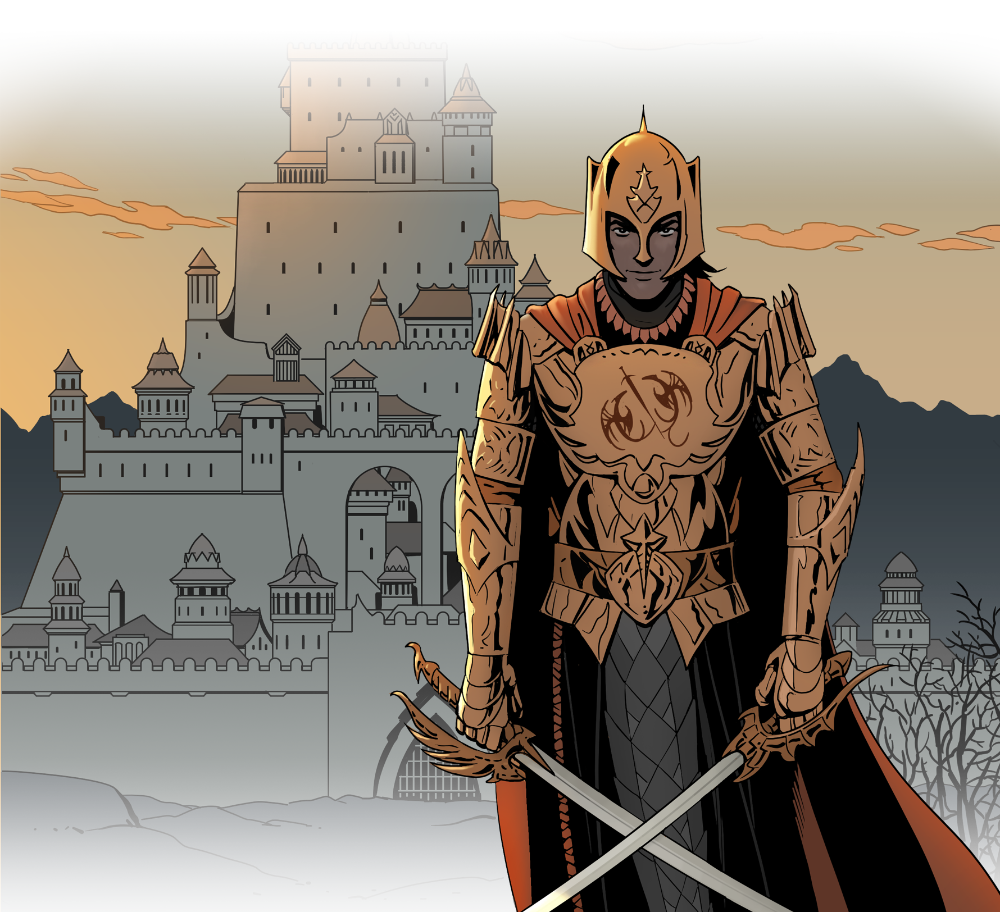

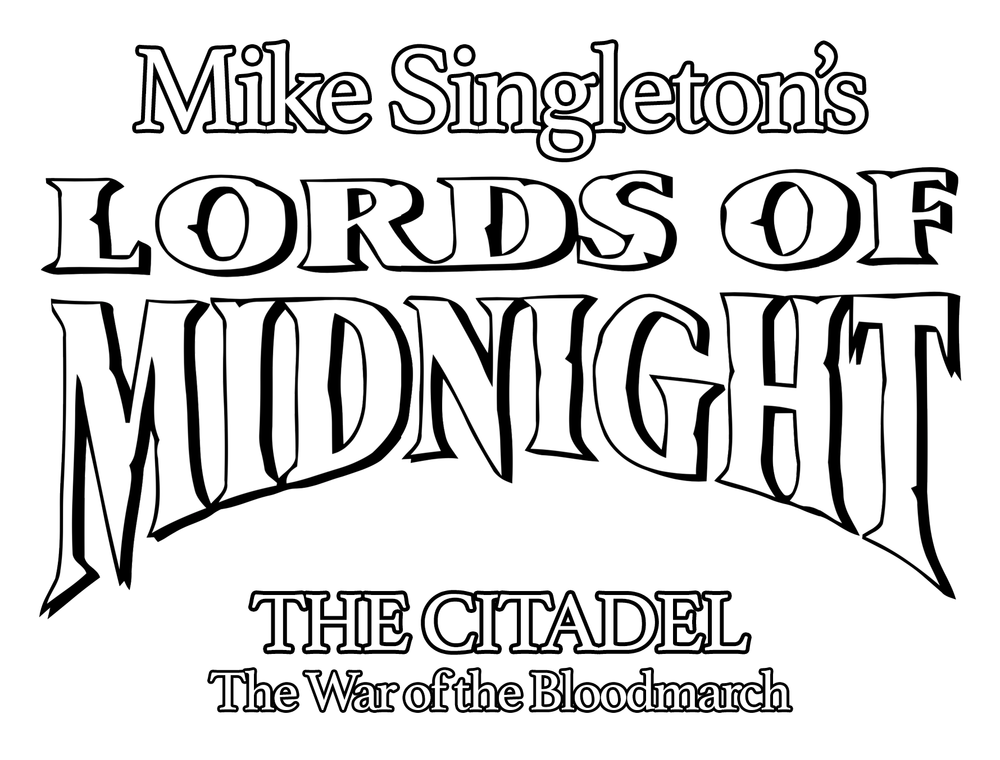

iel introduce new allies and show the party’s urgency.

## Chapter 3 — Galahar’s Tale

On Immiel, Galahar (a Golden fey) warns Luxor about a secret, growing evil in the Blood March (the “Dark Fey” and other menaces). He recounts history and folklore that illuminate how danger is spreading — raising the stakes of Luxor’s mission. 

## Chapter 4 — Rorthron the Wise

Rorthron the Wise learns that Shareth the Heartstealer had a child placed with a slave (Cirithel) who later bore a son, Anderlane — meaning Luxor may have unexpected kin in the Blood March. Rorthron prepares to travel there; this expands the quest’s scope and hints at deeper political/magical entanglements.

## Chapter 5 — The Marish

The Cormorant sails toward Coromand and encounters foul weather and peril (the Marish / storm). Meanwhile we see more of the wider consequences of witching-objects: the book contains long flashback material about Boroth (how a “witching stone” twisted him into cruelty in the Golden Citadel), showing how magical artefacts can corrupt leaders and societies. This material establishes a parallel threat to the Eye-of-the-Moon plot.

# Chapter-by-chapter (longer)

## Chapter 1 – The Minstrel

Luxor the Moonprince walks with his grandson, Corleth, through the bustling streets of Xajorkith. Their conversation reveals a tension between Corleth’s yearning for adventure and Luxor’s caution born of age and experience. That evening, a wandering minstrel named Derim arrives at the palace. His ragged clothes contrast with his strikingly beautiful voice, and he sings a haunting ballad about Sherehar and Asim. The final verse hints at the location of the “Eye of the Moon,” a jewel once set in the Moon Ring of Midnight. Luxor recognises the ballad’s reference as more than mere song — it may be a clue to the Eye’s whereabouts. He explains to Corleth that the Eye was stolen generations ago and that, if recovered by an enemy, it could be used for great harm. Determined to protect Midnight, Luxor resolves to journey to Coromand, where Derim’s song suggests the Eye lies hidden in the King’s Tower. Derim is offered a place at court but not on the quest.

## Chapter 2 – The Cormorant

Preparations for the voyage are made. Luxor enlists Lord Blood, an old friend and formidable warrior, to aid him. Corleth and Arin, Lord Blood’s son, plead to join the expedition. After some resistance, Luxor allows them to come, warning of the dangers ahead. They sail aboard the swift ship Cormorant, travelling down the River Imilvir, across the open plains, and into the Last Mountains. The crew faces natural hazards, but their spirits are lifted by the sense of purpose. They eventually reach the shimmering Lake Glimormir, where they are guided by a mysterious white swan to the Isle of Immiel. There, they are welcomed by Galahar the Calm, a Golden Fey lord, whose home is an oasis of peace in a troubled land.

## Chapter 3 – Galahar’s Tale

During their stay on Immiel, Galahar warns Luxor about the growing threat of the Dark Fey — once noble beings who have fallen into cruelty and corruption. He recounts the tragic history of Ravenwood: King Coronoth rescued and married Arithel, who had fled from a northern prince obsessed with a magical jewel called the witching stone. Arithel bore two sons, Careth and Boroth. Boroth, the darker of the two, discovered the stone’s power and began using it to fulfil his desires, becoming increasingly corrupted. Despite Careth’s attempts to intervene, Boroth’s obsession deepened. Eventually, Boroth killed his father and burned the Golden Citadel, seizing power while pretending innocence. This cautionary tale reinforces the dangers of powerful magical artefacts like the Eye of the Moon, strengthening Luxor’s resolve to secure it before similar corruption takes root again.

## Chapter 4 – Rorthron the Wise

Rorthron, a sagacious and respected figure, receives alarming news from King Melthelion of the South. The report concerns Shareth the Heartstealer, a dangerous and ambitious woman from the Blood March. Years ago, she bore a child and entrusted it to a slave woman, Cirithel. This woman later gave birth to a son, Anderlane, raising questions about his parentage and potential claim to power. Fearing the instability this could bring, Rorthron decides to travel to the Blood March to investigate. His preparations reflect his awareness that this is no simple matter of lineage — in the March, politics, old grudges, and sorcery intertwine, and one misstep could ignite larger conflict. The chapter closes with Rorthron resolved to confront whatever truths the March may hold.

## Chapter 5 – The Marish

The Cormorant continues its voyage toward Coromand, venturing into the Marish, a treacherous region of marshland and waterways. The journey is beset by storms and shifting currents, testing the crew’s skill and endurance. Alongside the physical dangers, the narrative draws parallels between their present struggle and the ancient corruption wrought by the witching stone in Galahar’s tale. The story of Boroth’s cruelty and the fall of the Golden Citadel re-emerges in detail here, reinforcing the central theme: magical artefacts, once tainted, can bring kingdoms to ruin. The chapter ends with the party pressing onward, undeterred by the hostile waters and the echoes of history’s warnings.

## The Map Dimensions
One of the interesting things about the maps is that some of the data is 512x512 and some of it 256x256 I have scaled the maps so they are all the same, which means some granularity has been lost. I think before they could be used, the maps would need little hand tuning.

At 512 the map becomes 64 times the size of LoM, that is the LoM map fits into The Citadel 64 times. At 256 the number is reduce to 16. 16 Feels right because it pretty much relates to the number of realms or kingdoms.

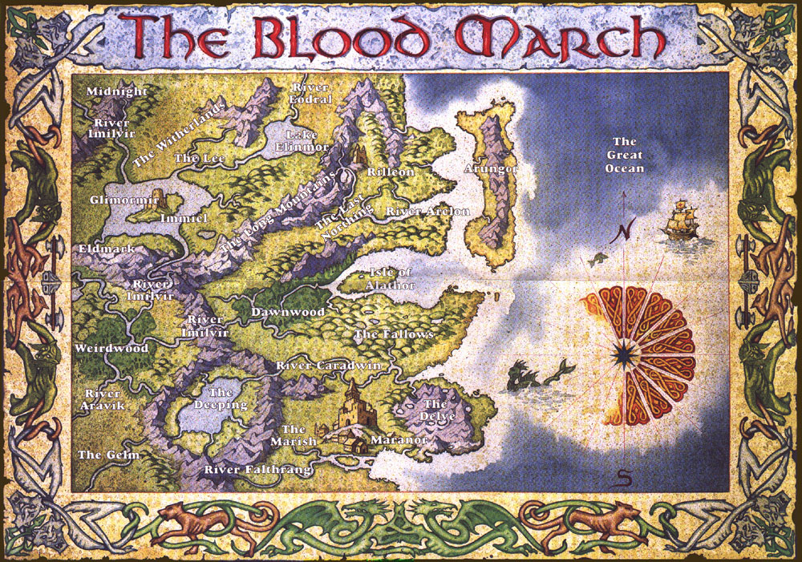

# The Map 

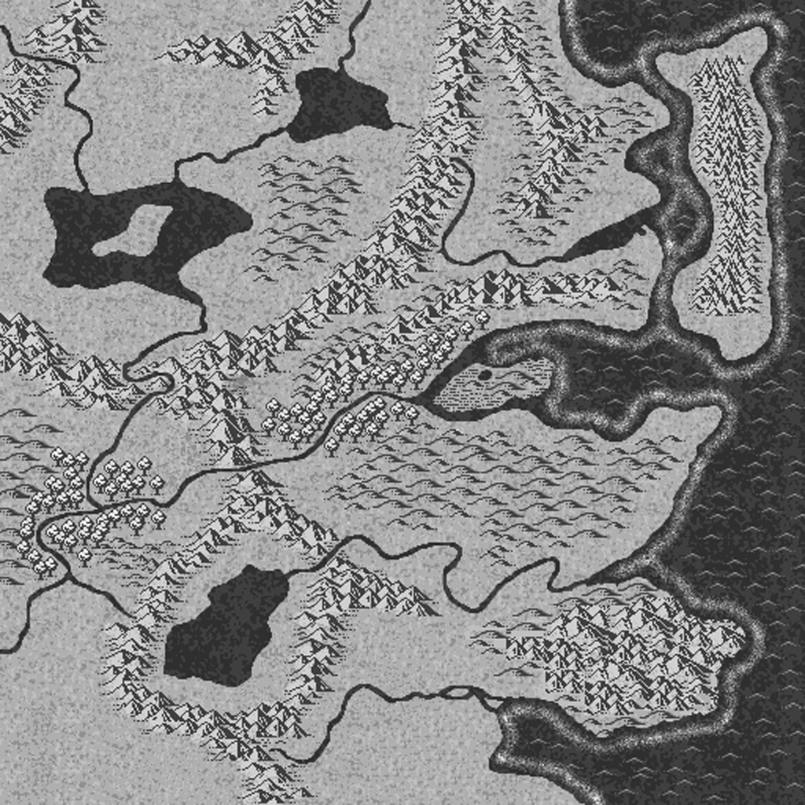

# The Kingdoms

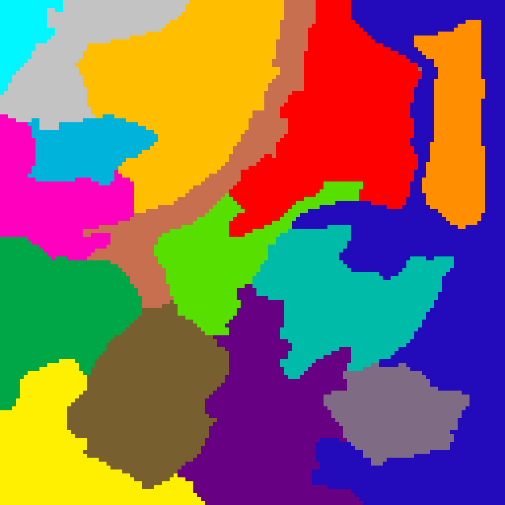

    - The Witherlands
    - The Lee
    - Eldmark
    - The Long Mountains
    - The Last Northing
    - Arungor
    - Wierdwood
    - Dawnwood
    - The Fallows
    - The Gelm
    - The Deeping
    - The Delve
    - The Marish
    - Glimormir
    - The Great Ocean
    - Midnight

<table>
<colgroup><col style="width:200px"><col></colgroup>
<tr><td></td><td>

**Glimormir**  The Great Lake of Glimormir lies in the northwest of the Bloodmarch. On its western shore is the Eldmark, on the eastern shore the Lee and on the northwest shore are the Witherlands. In the midst of the lake lies the fair Isle of Immiel, home of the Golden Fey and seat of their King, Galahar the Calm. The realm of Glimormir is the one sanctuary in the Bloodmarch where the evil of the Dark Fey cannot penetrate, such is the power and purity of Galahar.

</td></tr>
<tr><td></td><td>

**The Long Mountains**  The Long Mountains begin in the far north of the Bloodmarch and sweep down to the southwest like a scimitar. In the north, they lie between the Lee to the west and the Last Northing to the east. Further south, they touch upon Dawnwood to the east, the Deeping to the south, Weirdwood to the west and the Eldmark to the north. The mighty River Imilvir cuts through the Long Mountains in the land of Scaradir before tumbling into Dawnwood. The Long Mountains are the realm of the Long Dwarves and there are seven lands within its borders, Erenim, Isilfrey, Thordroth, Farwain, Beomir, Scaradwin and Scaradir. In Beomir stands the Citadel of the King of the Long Mountains.

</td></tr>
<tr><td></td><td>

**Weirdwood**  Weirdwood lies in the west of the Bloodmarch, south of the Eldmark, east of the Long Mountains and the Deeping, north of the Gelm. Through its midst flows the mighty River Imilvir. Weirdwood is the realm of the High Fey and there are nine lands within its borders, Elinvar, Merikith, Arelmar, the Shimmering Forest, Aradel, the Forgotten Forest, the Forest of Forever, the Whispering Forest and the Golden Forest. In the Shimmering Forest, near the banks of the River Imilvir stands the Citadel of the High King of Weirdwood.

</td></tr>
<tr><td>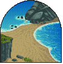</td><td>

**The Great Ocean**  To the east of the Bloodmarch lies the Great Ocean. In the north, it beats upon the shores of the Last Northing and separates the Isle of Arungor from the mainland. Further south, it crashes upon the shores of the Fallows, the Delve and the Marish. There are six seas within the Great Ocean, the Sea of Galorwain in the far north, the Sea of Fire betwixt Arungor and the Last Northing, the Weeping Sea east of Arungor, the Grey Sea east of the Fallows, the Sea of Skulls off the coast of the Delve and, east of the Marish, the Shining Sea which reaches south beyond the Bloodmarch to Coromand.

</td></tr>
<tr><td></td><td>

**The Marish**  The Marish lies in the southeast of the Bloodmarch, west of the Delve, south of Dawnwood and the Fallows, east of the Deeping and the Gelm. Through the heart of the Marish flows the River Falthrang churning its way west from the mountains of the Deeping to the Bay of Ulmor and the Great Ocean. The Marish is the bleak and desolate realm of the Dark Fey and there are nine lands within its borders, Gliwain, Malgor, Dwardor, Barathor, the Plain of Death, Maranor, the Plain of Ravens and the Burning Plain. In Maranor, on an island in the Falthrang, stands the Dark Citadel of Boroth the Wolfheart, High King of the Dark Fey where hostages from all the realms of the Bloodmarch languish in the dungeons.

</td></tr>
<tr><td></td><td>

**The Deeping**  The Deeping lies in the south of the Bloodmarch, south of the Long Mountains, Weirdwood and Dawnwood, east of the Marish, west of the Gelm. Within its mighty ring of mountains lies Lake Tarefyr whose icy blue waters feed the swift-flowing River Caradwin. The Deeping is the realm of the Deeping Dwarves and there are seven lands within its borders, the Mountains of Thunder, the Mountains of Dawn, Ararak, Sharenor, Ildemar, Tharn, Zaragrorn and Tharn. In the Mountains of Thunder stands the Citadel of the King of the Deeping.

</td></tr>
<tr><td>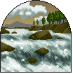</td><td>

**The Last Northing**  The Last Northing lies in the northeast of the Bloodmarch, west of Arungor and the Great Ocean, east of the Long Mountains, north of Dawnwood. Through its midst flows the mighty river Arelon, curling westwards from the Long Mountains to the Bay of Tharran and the Sea of Fire. The Last Northing is the realm of the Arakai and there are eleven lands within its borders, Sharmark, the Sapphire Mountains, Melibor, Rilleon, Elmir, Ravenfrey, Erefar, Galorbard, the Crimson Mountains, Orcar and Caramane. In Rilleon, on the northern bank of the Arelon, stands the Citadel of the King of the Last Northing.

</td></tr>
<tr><td>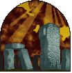</td><td>

**The Land of Midnight**  The Land of Midnight lies to the northwest of the Bloodmarch, northwest of the Witherlands. Only a tiny portion of Midnight touches upon the Bloodmarch, but here, in Corelay, the mighty River Imilvir begins its southward journey to the Great Ocean. The Castle of Corelay, a short way north of the Imilvir, is bastion of Prince Morkin and the place where, if Luxor the Moonprince be rescued or perish, a mighty army of warriors from the four corners of Midnight will gather to march upon Boroth the Wolfheart and the Dark Fey.

</td></tr>
<tr><td>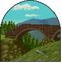</td><td>

**The Delve**  The Delve lies in the southeast of the Bloodmarch. To the west is the Marish, to the east the Sea of Skulls and the Great Ocean. The Delve is a mountainous land and it is the realm of the Giants. Within its borders are twelve lands, Grorn, Finrod, the Iron Mountains, Gagrun, Tark, Othrym, Skirol, the Big Mountains, the Isle of Storms, Thordrin, Athruk and Tark. In Skirol stands the Citadel of the Great King of the Delve.

</td></tr>
<tr><td>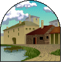</td><td>

**The Gelm**  The Gelm lies in the southwest of the Bloodmarch, west of the Marish and the Deeping, south of Weirdwood. The Gelm is the principality of the Gelmings and within its borders are five broad lands, Finfyr, Geremiel, Samarand, Gilgrath and Emergelm. In Samarand stands the Citadel of the Prince of the Gelm.

</td></tr>
<tr><td>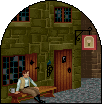</td><td>

**The Witherlands**  The Witherlands lie in the northwest of the Bloodmarch, east of the Lee, north of Glimormir and the Eldmark, southwest of Midnight. Through their midst flows the mighty River Imilvir before tumbling into the calm waters of Glimormir. The Witherlands are the realm of the Kith. Within the borders lie but three lands, Eomir, Erifel and Sareon. In Eomir stands the Citadel of the Prince of the Witherlands.

</td></tr>
<tr><td>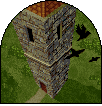</td><td>

**The Fallows**  The Fallows lies in the east of the Bloodmarch, north of the Marish, east of Dawnwood. Further east lies only the Great Ocean. The Fallows is the realm of the Uskarg and within its borders there are nine lands, the Isle of Alathor, Elinbrand, Arabar, Skordroth, Theodel, Cerrelm, Roreon, Athrudan and Erilmark. In Roreon stands the Citadel of the King of the Fallows.

</td></tr>
<tr><td>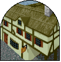</td><td>

**The Lee**  The Lee lies in the north of the Bloodmarch, east of the Witherlands and the Eldmark, west of the Long Mountains, on the eastern shore of Glimormir. At the heart of the Lee lies Lake Elinmor from whence the River Eodral flows south into Lake Glimormir. The Lee is the realm of the Athelings and within its borders there are eight lands, Rilnor, Thumar, Sharvik, Imildral, Varorn, Melthor, Cerevere and Ceremelth. In Varorn stands the Citadel of the King of the Athelings.

</td></tr>
<tr><td>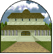</td><td>

**Immiel**  Immiel, the fairest isle of all, lies in Glimormir in the northwest of the Bloodmarch. Here, all are kept safe from the ravages of the Dark Fey by Galahar the Calm, King of the Golden Fey and Lord of Immiel. His great Citadel stands atop the cliffs on the southern coast of the island.

</td></tr>
<tr><td>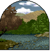</td><td>

**The Eldmark**  The Eldmark lies in the west of the Bloodmarch, north of Weirdwood, south of the Witherlands, west of the Long Mountains and the Lee. On its eastern borders, the mighty River Imilvir flows south from Glimormir towards Weirdwood. The Eldmark is the realm of the Eldrin and within its borders there are but four lands, Arelban, Arunvere, Meranor and Erilan. In Arunvere stands the Citadel of the Queen of the Eldmark.

</td></tr>
<tr><td></td><td>

**The Mists of Oblivion**  At the borders of the Bloodmarch, the good warrior will find the Mists of Oblivion and is well-advised to turn back before the mists thicken to impenetrable lest he vanish from the memory of his comrades forever, venturing instead to other less stricken lands.

</td></tr>
<tr><td>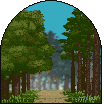</td><td>

**Dawnwood**  Dawnwood lies at the very heart of the Bloodmarch, south of the Last Northing, east of the Long Mountains, north of the Deeping and the Marish, west of the Fallows. Through its green forest flows the mighty River Imilvir before plunging into the Bay of Eregoth and the Great Ocean. Dawnwood is the realm of the Dawn Fey and within its borders there are seven lands, Maralan, Romiel, the Forest of Songs, Carafel, Emerthen, Elorthard and Corithel. In Elorthard, south of the Imilvir, stands the Citadel of the King of Dawnwood.

</td></tr>
<tr><td>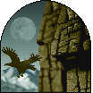</td><td>

**Arungor**  The Isle of Arungor lies in the northwest of the Bloodmarch, off the coast of the Last Northing. To the north is the Sea of Galorwain, to the east the Weeping Sea and to the west the Sea of Fire. Arungor is the realm of the Dragonlords and within its borders there are nine lands, the Dragon Mountains, Angelf, Rildroth, Sarnoth, Erivik, Shrygal, Ashnar, Cormir and Aragor. In Ashnar stands the Citadel of the Dragon King of Arungor.

</td></tr>
<tr><td></td><td>

**The River Imilvir**  The mighty river Imilvir winds its way through the length and breadth of the Bloodmarch, tumbling through mountains, forest and plains. The Imilvir is the Silver Road of the Blood March, where a ship may sail from the Witherlands to the Great Ocean.

</td></tr>
<tr><td>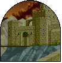</td><td>

**Castles**

</td></tr>
<tr><td>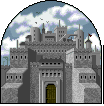</td><td>

**Citadels**

</td></tr>
</table>

# Kingdom Connections

| Kingdom | Connects to |
| --- | --- |
| **Witherlands** | Midnight, Lee, Glimormir, Eldmark |
| **Lee** | Witherlands, Long Mountains, Glimormir, Eldmark |
| **Eldmark** | Witherlands, Lee, Long Mountains, Wierdwood |
| **Long Mountains** | Lee, Last Northing, Dawnwood, Deeping, Wierdwood, Eldmark |
| **Last Northing** | Long Mountains, Dawnwood, Arungor |
| **Arungor** | Last Northing |
| **Wierdwood** | Eldmark, Long Mountains, Deeping, Gelm |
| **Dawnwood** | Long Mountains, Last Northing, Fallows, Marish, Deeping |
| **Fallows** | Dawnwood, Delve, Marish |
| **Gelm** | Wierdwood, Deeping, Marish |
| **Deeping** | Long Mountains, Dawnwood, Marish, Gelm, Wierdwood |
| **Delve** | Fallows, Marish |
| **Marish** | Gelm, Deeping, Dawnwood, Fallows, Delve |
| **Glimormir** | Witherlands, Lee, Eldmark |
| **Great Ocean** | Arungor, Last Northing, Fallows, Delve, Marish, Dawnwood |
| **Midnight** | Witherlands |

# The Regions

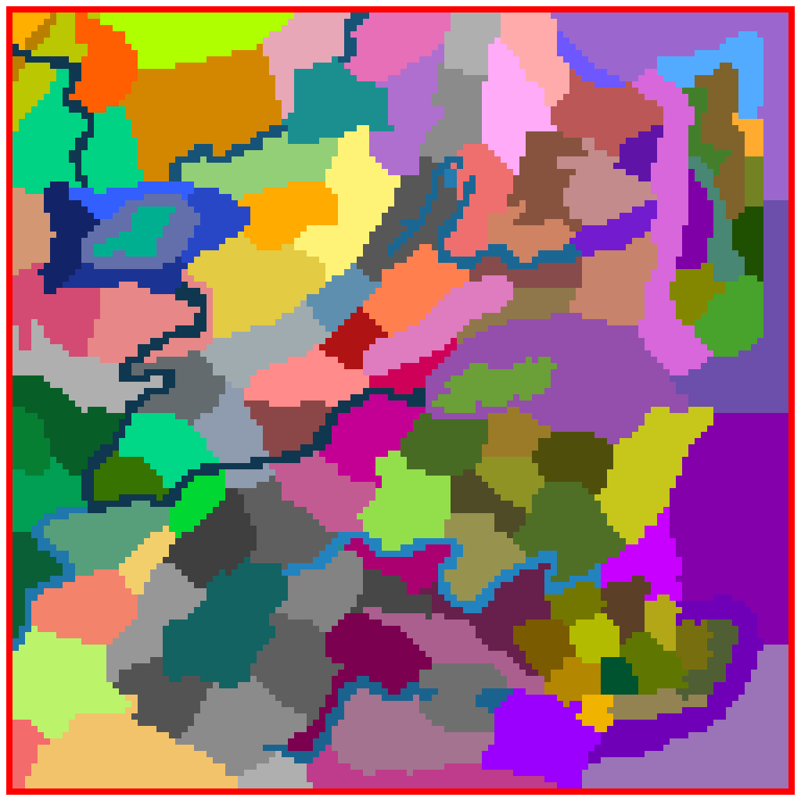

| Kingdom | Regions |
| --- | --- |
| **The Witherlands** | Imilvir Sareon Eomir Erifel |
| **The Lee** | Eodral Thumar Sharvik Imildral Melthor Varorn Rilnor Cerevere Ceremelth |
| **The Eldmark** | Arelban Arunvere Meranor Erilan Imilvir |
| **The Long Mountains** | Erenim Isilfrey Thordroth Arelon Farwain Beomir Saradwin Scaradir Corlon |
| **The Last Northing** | Sharmark Sapphire Elormane Melibor Rilleon Elmir Ravenfrey Mermaids Erefar Tharran Arelon Galorbard Crimson Orcar Caramane |
| **Arungor** | Angelf Dragon Rildroth Erivik Sarnoth Shrygal Faragor Serpents Cormir Ashnar |
| **Weirdwood** | Elinvar Arelmar Merikith Imilvir Shimmering Forgotten Whispering Golden Forever Aravik Aradel |
| **Dawnwood** | Maralan Romiel Songs Emerthen Elorthord Imilvir Corithel Carafel |
| **The Fallows** | Alathor Elinbrand Arabar Theodel Cerrelm Skordroth Roreon Erilmark Athrudan |
| **The Gelm** | Finfyr Geremiel Emergelm Samarand Gilgrath |
| **The Deeping,** | Thunder Ararak Dawn Tarefyr Sharenor Tharn Ildemar Zaragorn |
| **The Delve** | Grorn Finrod Corth Gogrun Iron Tark Othrym Big Storms Skirol Athruk Thordrin |
| **The Marish** | Malgor Caradwin Dwardor Barathor Death Valgrorn Maranor Falthrang Ravens Burning |
| **Glimormir** | Northern Eastern Western Southern Middle Immiel |
| **The Great Ocean** | Galorwain Fire Weeping Eregoth Grey Silfar Skulls Ulmor Shining |
| **Midnight** | Corelay Jade Last |

# Places

|  |  |  |  |  |  |  |  |  |  |  |  |  |  |  |  |
| --- | --- | --- | --- | --- | --- | --- | --- | --- | --- | --- | --- | --- | --- | --- | --- |
| Imilvir | Eodral | Arelon | Aravik | Caradwin | Falthrang | Elinmor | Tarefyr | Northern | Eastern | Southern | Western | Middle | Ulmor | Skulls | Shining |
| Silfar | Grey | Eregoth | Weeping | Fire | Galorwain | Tharran | Mermaids | Serpents | Immiel | Rilleon | Maranor | Corelay | Jade | Last | Erifel |
| Sareon | Eomir | Rilnor | Thumar | Sharvik | Imildral | Erenim | Isilfrey | Thordroth | Galorbard | Corlon | Farwain | Maralan | Beomir | Ceremelth | Carafel |
| Saradwin | Emerthen | Scaradir | Meranor | Arelban | Arunvere | Erilan | Elinvar | Arelmar | Shimmering | Forgotten | Whispering | Forever | Golden | Finfyr | Geremiel |
| Samarand | Emergelm | Ildemar | Zaragorn | Gilgrath | Tharn | Sharenor | Ararak | Thunder | Dawn | Merikith | Aradel | Valgrorn | Malgor | Dwardor | Death |
| Barathor | Burning | Ravens | Iron | Tark | Athruk | Thordrin | Storms | Big | Corth | Skirol | Othrym | Grorn | Gogrun | Finrod | Songs |
| Crimson | Elorthord | Corithel | Alathor | Elinbrand | Gliwain | Athrudan | Skordroth | Erilmark | Arabar | Theodel | Cerrelm | Roreon | Caramane | Romiel | Orcar |
| Ravenfrey | Erefar | Elmir | Melibor | Sharmark | Sapphire | Elormane | Dragon | Rildroth | Angelf | Erivik | Sarnoth | Shrygal | Faragor | Ashnar | Cormir |
| Cerevere | Melthor | Varorn | Oblivion | Oblivion |  |  |  |  |  |  |  |  |  |  |  |

# Neighbouring Regions

| Region | Count | Neighbouring Regions |
| --- | --- | --- |
| **Imilvir** | 25 | Corelay, Last, Jade, Erifel, Eomir, Northern, Meranor, Erilan, Saradwin, Elinvar, Merikith, Shimmering, Forgotten, Whispering, Aradel, Scaradir, Emerthen, Carafel, Songs, Corithel, Elorthord, Southern, Aravik, Eregoth, Elinmor |
| **Eodral** | 6 | Rilnor, Varorn, Thumar, Sharvik, Northern, Elinmor |
| **Arelon** | 8 | Thordroth, Isilfrey, Rilleon, Galorbard, Erefar, Orcar, Tharran, Corlon |
| **Aravik** | 6 | Forever, Forgotten, Whispering, Finfyr, Geremiel, Imilvir |
| **Caradwin** | 11 | Tarefyr, Silfar, Dawn, Malgor, Barathor, Grorn, Thunder, Corithel, Gliwain, Athrudan, Erilmark |
| **Falthrang** | 9 | Gilgrath, Zaragorn, Valgrorn, Maranor, Death, Gilgrath, Burning, Ravens, Ulmor |
| **Elinmor** | 8 | Thumar, Sharvik, Imildral, Melthor, Varorn, Imilvir, Eodral, Rilnor |
| **Tarefyr** | 8 | Caradwin, Thunder, Ararak, Sharenor, Ildemar, Zaragorn, Tharn, Dawn |
| **Northern** | 8 | Imilvir, Middle, Eomir, Rilnor, Varorn, Eastern, Eodral, Western |
| **Eastern** | 6 | Northern, Southern, Middle, Varorn, Cerevere, Ceremelth |
| **Southern** | 6 | Western, Middle, Eastern, Imilvir, Arunvere, Meranor |
| **Western** | 6 | Eomir, Northern, Southern, Middle, Arelban, Arunvere |
| **Middle** | 5 | Northern, Southern, Eastern, Western, Immiel |
| **Ulmor** | 9 | Falthrang, Maranor, Ravens, Burning, Death, Tark, Athruk, Skulls, Shining |
| **Skulls** | 9 | Athruk, Thordrin, Ulmor, Shining, Storms, Big, Corth, Silfar, Grey |
| **Shining** | 4 | Burning, Ulmor, Skulls, Grey |
| **Silfar** | 7 | Caradwin, Erilmark, Roreon, Grey, Finrod, Corth, Skulls |
| **Grey** | 5 | Roreon, Weeping, Silfar, Skulls, Shining |
| **Eregoth** | 11 | Fire, Weeping, Roreon, Cerrelm, Arabar, Elinbrand, Alathor, Imilvir, Songs, Romiel, Caramane |
| **Weeping** | 8 | Fire, Ashnar, Shrygal, Eregoth, Roreon, Grey, Galorwain, Sarnoth |
| **Fire** | 14 | Eregoth, Weeping, Ashnar, Cormir, Melibor, Mermaids, Ravenfrey, Tharran, Caramane, Serpents, Faragor, Rildroth, Angelf, Fire |
| **Galorwain** | 8 | Sharmark, Melibor, Elormane, Fire, Angelf, Weeping, Erivik, Sarnoth |
| **Tharran** | 6 | Fire, Caramane, Arelon, Erefar, Elmir, Ravenfrey |
| **Mermaids** | 3 | Ravenfrey, Melibor, Fire |
| **Serpents** | 3 | Fire, Cormir, Faragor |
| **Immiel** | 1 | Middle |
| **Rilleon** | 9 | Arelon, Thordroth, Galorbard, Orcar, Erefar, Elmir, Sapphire, Isilfrey, Corlon |
| **Maranor** | 5 | Falthrang, Valgrorn, Death, Ravens, Ulmor |
| **Corelay** | 2 | Imilvir, Last |
| **Jade** | 5 | Imilvir, Last, Erifel, Eomir, Sareon |
| **Last** | 3 | Imilvir, Corelay, Jade |
| **Erifel** | 6 | Jade, Sareon, Rilnor, Eomir, Imilvir, Eomir |
| **Sareon** | 4 | Jade, Erifel, Rilnor, Thumar |
| **Eomir** | 7 | Imilvir, Northern, Western, Erifel, Rilnor, Jade, Arelban |
| **Rilnor** | 8 | Sareon, Erifel, Eomir, Northern, Varorn, Elinmor, Thumar, Eodral |
| **Thumar** | 5 | Elinmor, Sharvik, Rilnor, Sareon, Eodral |
| **Sharvik** | 6 | Thumar, Erenim, Imildral, Elinmor, Thumar, Eodral |
| **Imildral** | 6 | Sharvik, Erenim, Isilfrey, Thordroth, Melthor, Elinmor |
| **Erenim** | 5 | Sharmark, Sapphire, Isilfrey, Imildral, Sharvik |
| **Isilfrey** | 7 | Erenim, Sapphire, Rilleon, Arelon, Thordroth, Imildral, Corlon |
| **Thordroth** | 8 | Arelon, Isilfrey, Rilleon, Galorbard, Farwain, Melthor, Imildral, Corlon |
| **Galorbard** | 7 | Thordroth, Arelon, Rilleon, Orcar, Crimson, Maralan, Farwain |
| **Corlon** | 4 | Arelon, Thordroth, Rilleon, Isilfrey |
| **Farwain** | 6 | Thordroth, Galorbard, Maralan, Beomir, Ceremelth, Melthor |
| **Maralan** | 5 | Farwain, Galorbard, Crimson, Carafel, Beomir |
| **Beomir** | 7 | Ceremelth, Farwain, Maralan, Carafel, Scaradir, Saradwin, Meranor |
| **Ceremelth** | 6 | Cerevere, Melthor, Farwain, Beomir, Meranor, Eastern |
| **Carafel** | 8 | Maralan, Crimson, Songs, Elorthord, Imilvir, Emerthen, Scaradir, Beomir |
| **Saradwin** | 5 | Imilvir, Beomir, Scaradir, Merikith, Erilan |
| **Emerthen** | 5 | Carafel, Imilvir, Elorthord, Corithel, Scaradir |
| **Scaradir** | 9 | Imilvir, Beomir, Carafel, Emerthen, Corithel, Thunder, Ararak, Merikith, Saradwin |
| **Meranor** | 6 | Southern, Imilvir, Ceremelth, Erilan, Arunvere, Beomir |
| **Arelban** | 3 | Eomir, Western, Arunvere |
| **Arunvere** | 5 | Western, Southern, Arelban, Meranor, Erilan |
| **Erilan** | 5 | Arunvere, Meranor, Imilvir, Saradwin, Elinvar |
| **Elinvar** | 6 | Erilan, Imilvir, Merikith, Shimmering, Forgotten, Arelmar |
| **Arelmar** | 2 | Elinvar, Forgotten |
| **Shimmering** | 6 | Imilvir, Elinvar, Merikith, Aradel, Whispering, Forgotten |
| **Forgotten** | 7 | Arelmar, Elinvar, Imilvir, Shimmering, Whispering, Aravik, Forever |
| **Whispering** | 8 | Shimmering, Imilvir, Aradel, Golden, Finfyr, Aravik, Forever, Forgotten |
| **Forever** | 5 | Forgotten, Aravik, Whispering, Finfyr, Geremiel |
| **Golden** | 5 | Whispering, Aradel, Ararak, Sharenor, Finfyr |
| **Finfyr** | 6 | Whispering, Golden, Sharenor, Geremiel, Aravik, Forever |
| **Geremiel** | 7 | Forever, Aravik, Finfyr, Sharenor, Ildemar, Samarand, Emergelm |
| **Samarand** | 5 | Geremiel, Ildemar, Zaragorn, Gilgrath, Emergelm |
| **Emergelm** | 2 | Geremiel, Samarand |
| **Ildemar** | 5 | Sharenor, Tarefyr, Zaragorn, Samarand, Geremiel |
| **Zaragorn** | 7 | Tarefyr, Tharn, Valgrorn, Falthrang, Gilgrath, Samarand, Ildemar |
| **Gilgrath** | 5 | Falthrang, Valgrorn, Burning, Samarand, Zaragorn |
| **Tharn** | 4 | Dawn, Valgrorn, Zaragorn, tarefyr |
| **Sharenor** | 6 | Golden, Ararak, Tarefyr, Ildemar, Geremiel, Finfyr |
| **Ararak** | 6 | Aradel, Scaradir, Thunder, Tarefyr, Sharenor, Golden |
| **Thunder** | 6 | Scaradir, Corithel, Caradwin, Dawn, Tarefyr, Ararak |
| **Dawn** | 7 | Caradwin, Thunder, Malgor, Dwardor, Valgrorn, Tharn, Tarefyr |
| **Merikith** | 6 | Imilvir, Saradwin, Scaradir, Aradel, Shimmering, Elinvar |
| **Aradel** | 6 | Imilvir, Merikith, Ararak, Golden, Whispering, Shimmering |
| **Valgrorn** | 10 | Dwardor, Death, Maranor, Falthrang, Ravens, Gilgrath, Zaragorn, Tharn, Dawn, Burning |
| **Malgor** | 7 | Caradwin, Gliwain, Athrudan, Barathor, Dwardor, Dawn, Corithel |
| **Dwardor** | 5 | Malgor, Barathor, Death, Valgrorn, Dawn |
| **Death** | 8 | Barathor, Maranor, Ulmor, Falthrang, Valgrorn, Dwardor, Iron, Tark |
| **Barathor** | 8 | Athrudan, Caradwin, Erilmark, Grorn, Iron, Death, Dwardor, Malgor |
| **Burning** | 6 | Gilgrath, Falthrang, Ravens, Valgrorn, Ulmor, Shining |
| **Ravens** | 5 | Falthrang, Valgrorn, Maranor, Ulmor, Burning |
| **Iron** | 5 | Grorn, Gogrun, Tark, Death, Barathor |
| **Tark** | 6 | Gogrun, Othrym, Athruk, Ulmor, Death, Iron |
| **Athruk** | 5 | Othrym, Thordrin, Skulls, Ulmor, Tark |
| **Thordrin** | 5 | Othrym, Skirol, Storms, Skulls, Athruk |
| **Storms** | 4 | Skulls, Thordrin, Skirol, Big |
| **Big** | 4 | Skulls, Storms, Skirol, Corth |
| **Corth** | 5 | Silfar, Skulls, Big, Skirol, Finrod |
| **Skirol** | 7 | Corth, Big, Storms, Thordrin, Othrym, Gogrun, Finrod |
| **Othrym** | 6 | Gogrun, Skirol, Thordrin, Athruk, Tark, Gogrun |
| **Grorn** | 6 | Erilmark, Caradwin, Finrod, Gogrun, Iron, Barathor |
| **Gogrun** | 6 | Grorn, Finrod, Skirol, Othrym, Tark, Iron |
| **Finrod** | 6 | Silfar, Corth, Skirol, Gogrun, Grorn, Erilmark |
| **Songs** | 7 | Imilvir, Eregoth, Carafel, Crimson, Romiel, Elorthord, Alathor |
| **Crimson** | 6 | Songs, Romiel, Orcar, Galorbard, Maralan, Carafel |
| **Elorthord** | 7 | Imilvir, Elinbrand, Gliwain, Corithel, Emerthen, Carafel, Songs |
| **Corithel** | 8 | Imilvir, Elorthord, Gliwain, Caradwin, Malgor, Thunder, Scaradir, Emerthen |
| **Alathor** | 5 | Eregoth, Arabar, Elinbrand, Songs, Romiel |
| **Elinbrand** | 7 | Eregoth, Arabar, Alathor, Theodel, Skordroth, Gliwain, Elorthord |
| **Gliwain** | 7 | Elinbrand, Skordroth, Athrudan, Caradwin, Malgor, Corithel, Elorthord |
| **Athrudan** | 6 | Skordroth, Erilmark, Caradwin, Barathor, Malgor, Gliwain |
| **Skordroth** | 5 | Theodel, Erilmark, Athrudan, Gliwain, Elinbrand |
| **Erilmark** | 10 | Cerrelm, Roreon, Silfar, Finrod, Grorn, Caradwin, Barathor, Athrudan, Skordroth, Theodel |
| **Arabar** | 5 | Eregoth, Alathor, Cerrelm, Theodel, Elinbrand |
| **Theodel** | 5 | Arabar, Cerrelm, Erilmark, Skordroth, Elinbrand |
| **Cerrelm** | 5 | Eregoth, Roreon, Erilmark, Theodel, Arabar |
| **Roreon** | 6 | Eregoth, Weeping, Grey, Silfar, Erilmark, Cerrelm |
| **Caramane** | 5 | Tharran, Fire, Eregoth, Romiel, Orcar |
| **Romiel** | 6 | Orcar, Caramane, Eregoth, Alathor, Songs, Crimson |
| **Orcar** | 7 | Erefar, Arelon, Caramane, Romiel, Crimson, Galorbard, Rilleon |
| **Ravenfrey** | 5 | Melibor, Mermaids, Fire, Tharran, Elmir |
| **Erefar** | 5 | Elmir, Tharran, Orcar, Arelon, Rilleon |
| **Elmir** | 6 | Sapphire, Melibor, Ravenfrey, Tharran, Erefar, Rilleon |
| **Melibor** | 10 | Elormane, Galorwain, Mermaids, Angelf, Rildroth, Fire, Ravenfrey, Elmir, Sapphire, Sharmark |
| **Sharmark** | 5 | Galorwain, Elormane, Melibor, Sapphire, Erenim |
| **Sapphire** | 6 | Sharmark, Melibor, Elmir, Rilleon, Isilfrey, Erenim |
| **Elormane** | 3 | Galorwain, Melibor, Sharmark |
| **Dragon** | 6 | Angelf, Erivik, Sarnoth, Shrygal, Rildroth, Faragor |
| **Rildroth** | 5 | Fire, Melibor, Angelf, Dragon, Faragor |
| **Angelf** | 6 | Galorwain, Dragon, Fire, Melibor, Erivik, Rildroth |
| **Erivik** | 4 | Angelf, Galorwain, Sarnoth, Dragon |
| **Sarnoth** | 5 | Erivik, Galorwain, Shrygal, Weeping, Dragon |
| **Shrygal** | 5 | Weeping, Ashnar, Faragor, Dragon, Sarnoth |
| **Faragor** | 7 | Fire, Serpents, Rildroth, Dragon, Shrygal, Ashnar, Cormir |
| **Ashnar** | 5 | Weeping, Shrygal, Faragor, Cormir, Fire |
| **Cormir** | 4 | Serpents, Fire, Faragor, Ashnar |
| **Cerevere** | 4 | Varorn, Melthor, Ceremelth, Eastern |
| **Melthor** | 7 | Imildral, Thordroth, Farwain, Ceremelth, Cerevere, Varorn, Elinmor |
| **Varorn** | 7 | Elinmor, Rilnor, Eodral, Northern, Eastern, Cerevere, Melthor |
| **Mists Oblivion** | 0 |  |

# Citadels and Castles

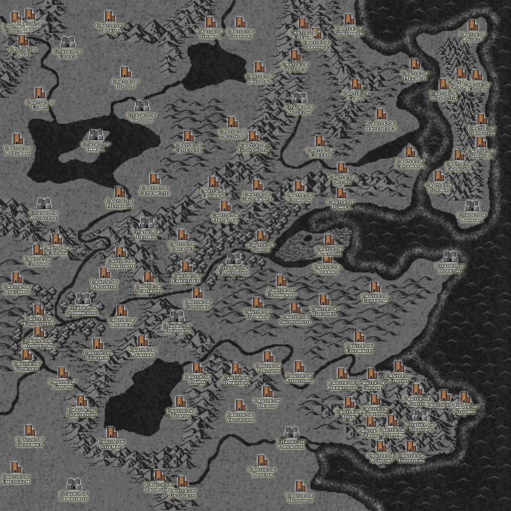

- The Citadel of Erifel is the foremost stronghold of the Kith and, for centuries, it has been the seat of the Princes of the Witherlands.
- The Citadel of Varorn is the principal stronghold of the Athelings and, for centuries it has been the seat of the Kings of the Lee.
- The Citadel of Arunvere is the jewel of the Eldrin and, since time immemorial, it has been the seat of the Queens of the Eldmark.
- The Citadel of Beomir is the strongest redoubt of the Long Dwarves and, since it was first hewn out of rock, it has been the seat of the Kings of the Long Mountains.
- The Citadel of Rilleon is the greatest fortress of the Arakai and, since the eagles flew north, it has been the seat of the Kings of the Last Northing.
- The Citadel of Ashnar is the mightiest stronghold of the Dragonlords and, ever since the Time of Taming, it has been the seat of the Kings of Arungor.
- The Shimmering Citadel is the greatest stronghold of the High Fey and, for a thousand years, it has been the seat of the Kings of Weirdwood.
- The Citadel of Elorthord is the mightiest fortress of the Fey and, for hundreds of years, it has been the seat of the Kings of Dawnwood.
- The Citadel of Roreon is the chief stronghold of the Uskarg and, for twelve reigns, it has been the seat of the Kings of the Fallows.
- The Citadel of Samarand is the strongest fortress of the Gelmings and, for centuries, it has been the seat of the Princes of the Gelm.
- The Citadel of Thunder is the mightiest redoubt of the Deeping Dwarves and, since the first king came into the mountains, it has been the seat of the Kings of the Deeping.
- The Citadel of Skirol is the strongest bastion of the Giants and it has been the seat of the Kings of the Delve for many moons.
- The Dark Citadel of Maranor is the mightiest bastion of the Dark Fey. It was the seat of the Fey Kings of the Marish even before the fall of the First Fey into evil. Now it is the foul lair of Boroth the Wolfheart, High King of the Marish, and in its dungeons he keeps prisoners hostage from all all the realms of the Bloodmarch.
- The Citadel of Immiel is the fair fortress of the Golden Fey and has been the seat of the Kings of Glimormir for over a thousand years.
- No citadel in the Great Ocean.
- No citadel in Midnight.
- No citadel in the Mists of Oblivion.

# The Lords

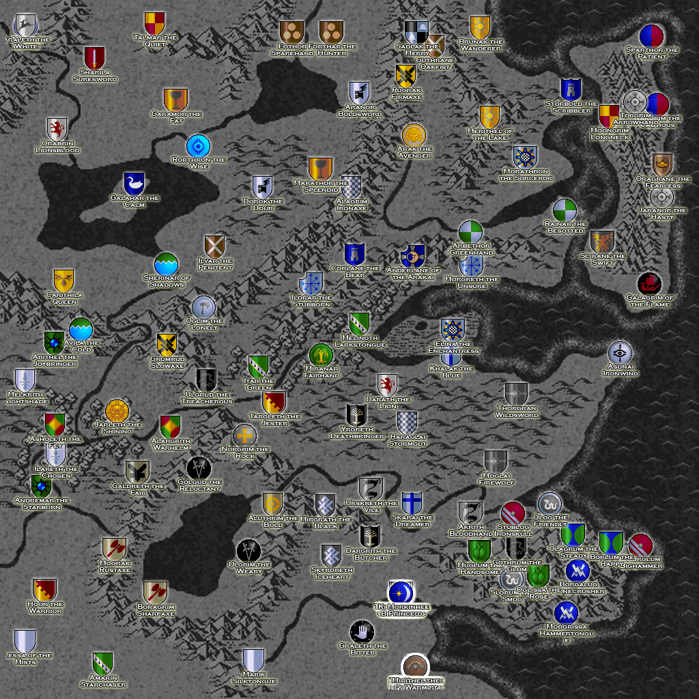

# The Terrain

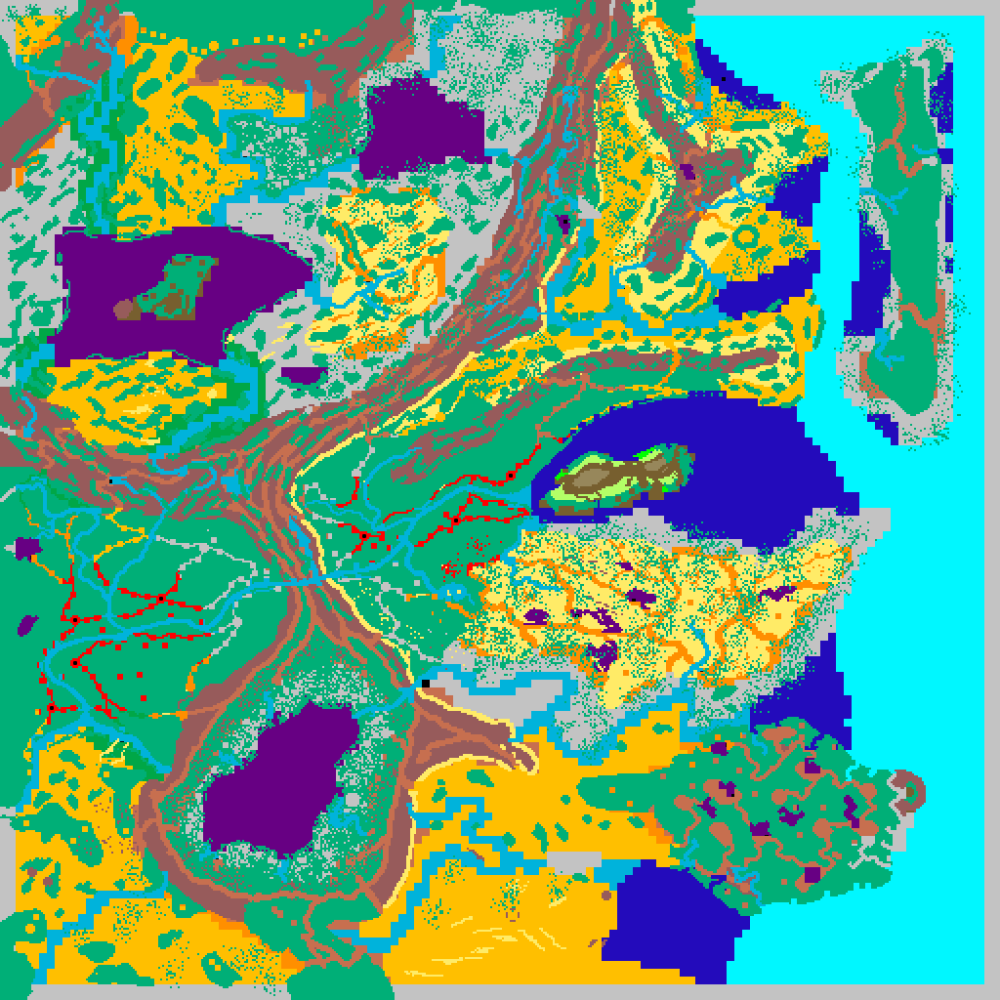

      - Forest
      - Trees
      - Mountains
      - Craggy Mountains
      - Rivers
      - Lakes
      - Downs
      - Lakeland
      - Swamp
      - Plains1
      - Foothills
      - Sea
      - Bays
      - Isle
      - Valley
      - Hills
      - Plains2

# Trees and Forests

The trees are interesting because they can be over the top of any other terrain, so we only have two areas of dense forest, but a lot of trees.

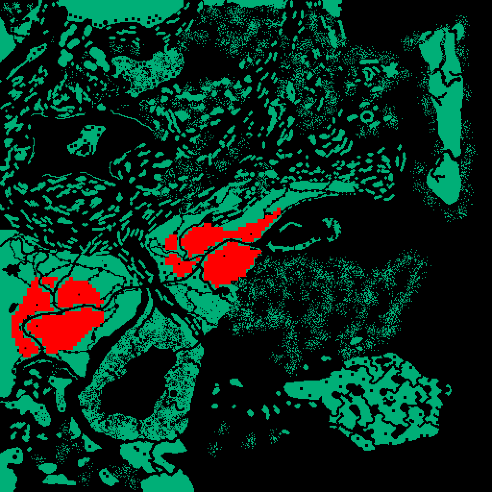

    - Weirdwood
    - Downed

# Mountains

Mountains also have a craggy mountain terrain as well, so they look like this.

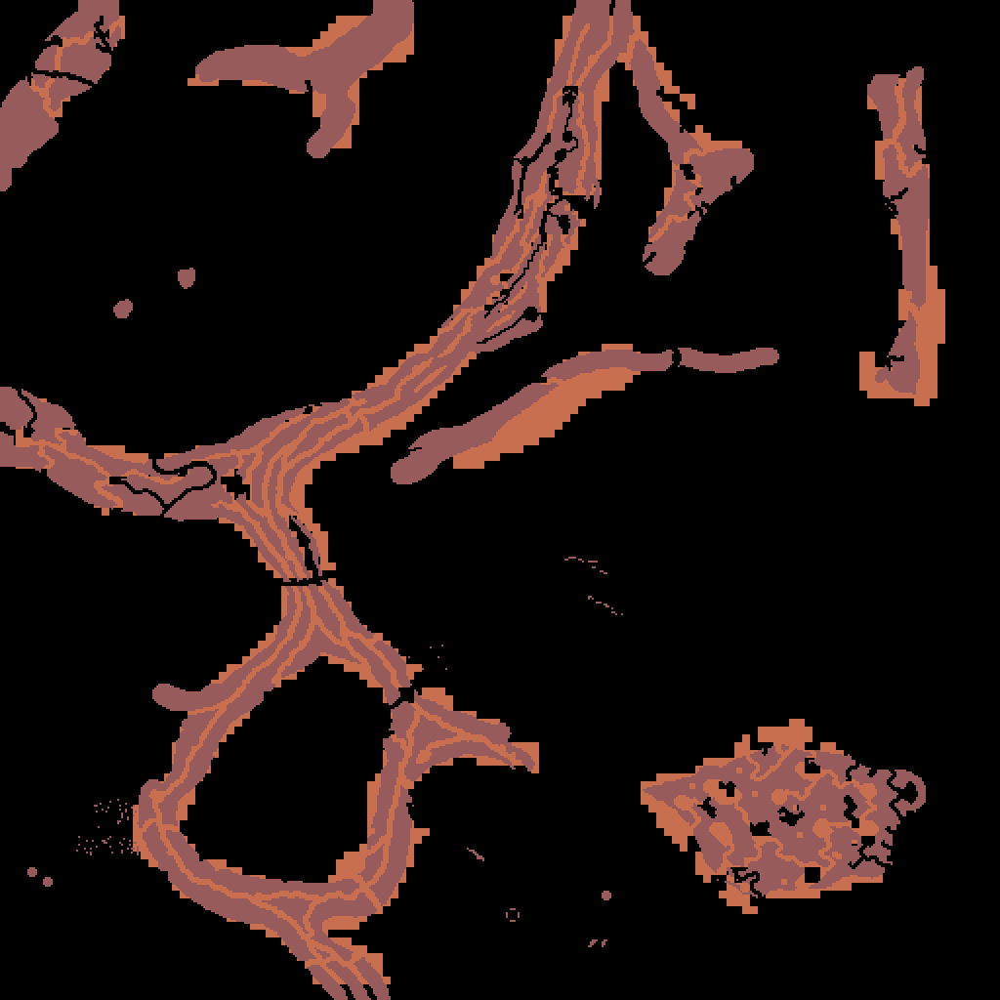

# Ground Routes

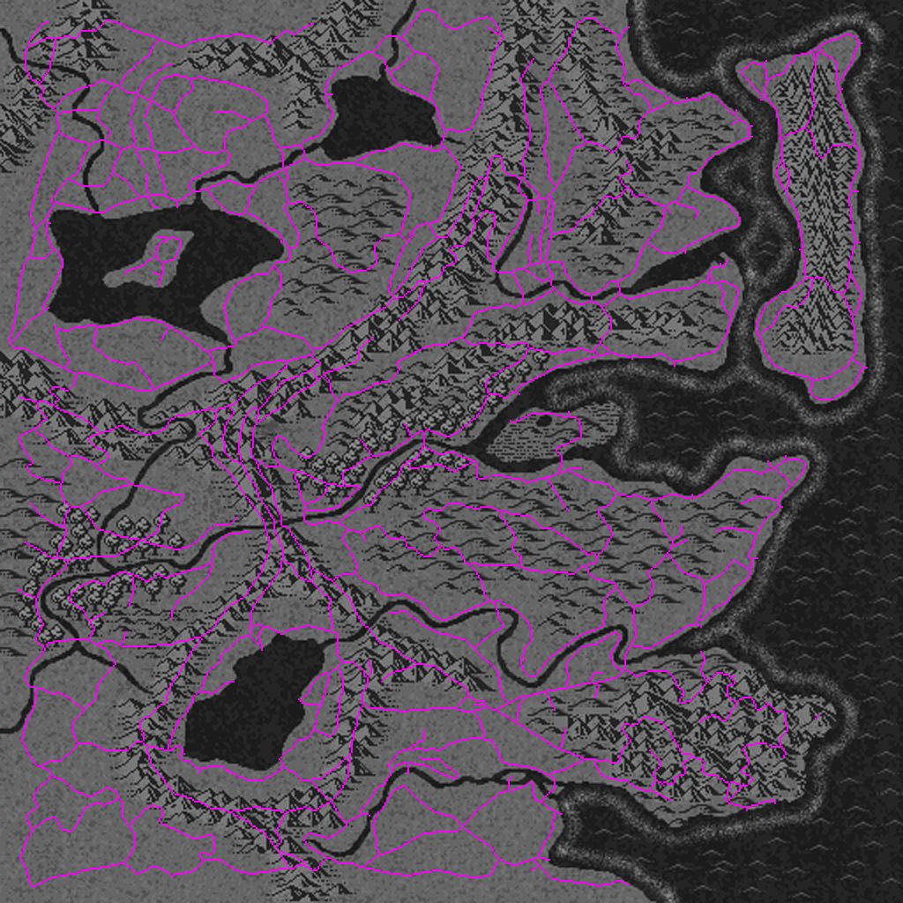

# Water Routes

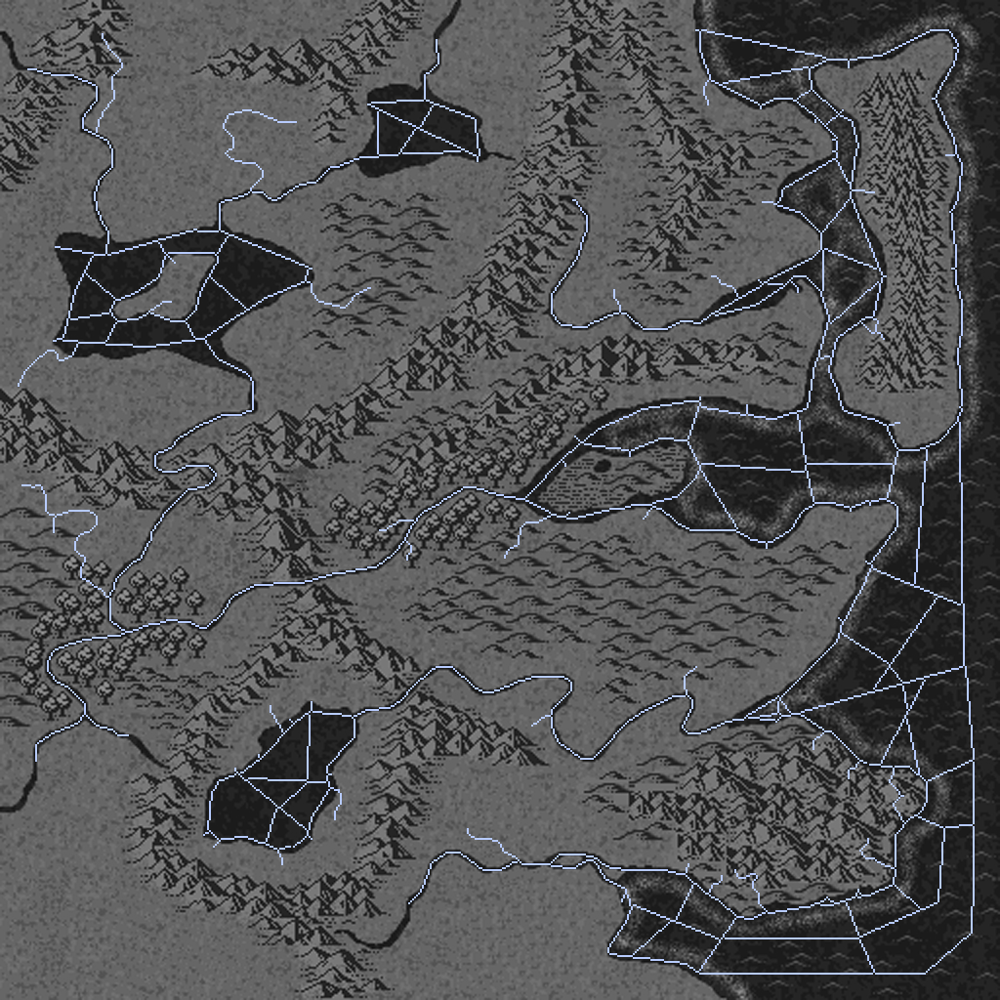

What is missing is any form of more interesting features, like villages, huts, puts, stones, liths, henges, etc.. etc... AnI think this is stuff that would need to be added to the maps to make a game more interesting.

# Terrain	

0, Land *

1, Plain

2, Mount

3, Mountains

4, Forest

5, Hills / Foothills

6, Valley *

7, Pass *

8, Gorge *

9, Ford *

10, Isle *

11, Marsh

12, Lake

13, River

14, Bay *

15, Sea

* Not image related, but name related

# Things

Troll

Wolves

Dragons

# Titles

0, 

1, Prince of Midnight

2, Guardian of the Tower of the Moon

3, Prince of the Witherlands

4, Princess Regent of the Witherlands

5, Queen of the Eldmark

6, King of the Athelings

7, King of the Long Mountains

8, King of the Last Northing

9, Dragon King of Arungor

10, High King of the Weirdwood

11, Princess of the Weirdwood

12, King of the Dawnwood

13, King of the Fallows

14, Prince of the Gelm

15, King of the Deeping

16, High King of the Marish

17, Captain of the Blood Guard

18, Lord Marshal of the Marish

19, Great King of the Delve

20, Queen of the Delve

# Races

|  |  |  |
| --- | --- | --- |
| the Kith | Kith | of the Kith |
| Athelings | Atheling | Atheling |
| Eldrin | Eldrin | Eldrin |
| Long Dwarves | Long Dwarf | Long Dwarf |
| Arakai | Arakai | Arakai |
| Dragonlords | Dragonlord | Dragonlord |
| High Fey | High Fey | High Fey |
| Dawn Fey | Dawn Fey | Dawn Fey |
| Uskarg | Uskarg | Uskarg |
| Gelmings | Gelming | Gelming |
| Deeping Dwarves | Deeping Dwarf | Deeping Dwarf |
| Giants | Giant | Giant |
| Dark Fey | Dark Fey | Dark Fey |
| Golden Fey | Golden Fey | Golden Fey |
| Corsairs | Corsair | Corsair |
| the Free | Lord of Midnight | of the Free |

<table>
<colgroup><col style="width:200px"><col></colgroup>
<tr><td></td><td>

**Wolves**  Long ago, when they were wild and free, the wolves were savage but noble hunters, feared but respected. Now, under the spell of Boroth the Wolfheart, they are the loathsome creatures of the Dark Fey. Moving silently ahead of Boroth's armies, they presage battle and death and destruction.

</td></tr>
<tr><td></td><td>

**Wild Cats**  These creatures of fierce grace inhabit only the wildest, most inaccessible mountains. So rare is the sight of one that throughout the Bloodmarch it is regarded as an omen of the greatest good fortune.

</td></tr>
<tr><td></td><td>

**Trolls**  Vicious, powerful and bloodthirsty, the witless trolls have long been the willing servants of the Dark Fey. Blindly loyal to Boroth the Wolfheart, they guard the vast dungeons of the Dark Citadel of Maranor, standing ready to slay any who seeks passage.

</td></tr>
<tr><td></td><td>

**Dragons**  Much ill has been spoken of dragons, but in truth they are wise and noble beasts. Their homeland is the Isle of Arungor, off the coast of the Last Northing where they live in friendship with the Dragonlords. Dragons will come to the aid of all good men in need and bear them swiftly through the skies to the place they seek.

</td></tr>
</table>

<table>
<colgroup><col style="width:200px"><col></colgroup>
<tr><td>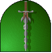</td><td>

**Bloodbringer**  In the Last Northing, Bloodbringer was the Sword of the Kings. He who wields Bloodbringer will command the loyalty of the Lords of the Arakai, leading them to battle and to glory.

</td></tr>
<tr><td>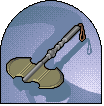</td><td>

**Widowmaker**  Widowmaker was the Great Axe of Dwarfdom, in the age when the dwarves were one people. The war for its possession split Dwarfdom asunder and gave rise to the bitterness that still estranges the Long Dwarves from their kin, the Deeping Dwarves. A dwarf who wields Widowmaker in battle is said to be invincible.

</td></tr>
<tr><td>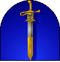</td><td>

**Aranath**  Aranath, in the tongue of the Fey, is the Golden Sword. It was made many summers ago, before the Dark Fey became touched by evil. In the hands of any Fey Lord, it is a weapon of ferocious power. In the hands of any other, it brings ill-fate.

</td></tr>
<tr><td>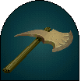</td><td>

**Persuader**  In the time of the first wars against the Dark Fey, Persuader was brought to the Bloodmarch by a Prince of the Gelm who had travelled south into Coromand seeking aid against Boroth and this axe was the magical gift he was given. He who wields Persuader is able to draw upon warriors from any stronghold not at war with his realm.

</td></tr>
<tr><td>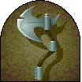</td><td>

**Skullcrusher**  Wrought in the Iron Mountains by dwarven smiths who sought the favour of the King of the Delve, Skullcrusher is a weapon of great power in the hands of any Giant, such that in battle he will fight with the strength of two.

</td></tr>
<tr><td>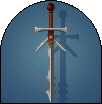</td><td>

**Swiftwing**  Forged with dragonsfire on the Isle of Arungor many long winters ago, Swiftwing makes its bearer as tireless as a dragon, needing no rest or shelter. Yet the wielder of Swiftwing should beware - if he is part of a fellowship, Swiftwing's magic will not work for its spirit is as free and lonely as the great beasts of Arungor.

</td></tr>
<tr><td>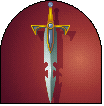</td><td>

**Stormblade**  Wrought long ago by the dwarven smiths of the Long Mountains and forged with dragonsfire Stormblade is a weapon of great power. The warrior who wields Stormblade is tireless in battle whilst his foes wilt with each blow.

</td></tr>
</table>

<table>
<colgroup><col style="width:200px"><col></colgroup>
<tr><td>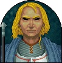</td><td>

**The Golden Fey**  Long have the Golden Fey dwelt on the Isle of Immiel in Glimormir, singing their songs and weaving their golden magic. Upon Immiel, their magic is so legendary against evil that Boroth dares not to assail the island even now but beyond their golden isle their powers fall away. Of all the peoples of the Bloodmarch, only the Golden Fey have no hostage held in the Dark Citadel.

</td></tr>
<tr><td>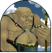</td><td>

**The Giants**  The Giants are possessed of great strength, but they are slow-witted and often use their strength unwisely. Their mountainous realm, the Delve, lies in the south-east of the Bloodmarch, betwixt the Marish and the Great Ocean. The King's stepdaughter, Melinissa the Sweet, is held hostage in Maranor by the Dark Fey.

</td></tr>
<tr><td></td><td>

**The Dark Fey**  Touched by evil long, long ago and now trapped in darkness, the Dark Fey are consumed by an unquenchable thirst for power and dominion. Their King, Boroth the Wolfheart, will not rest until he has enslaved the entire Bloodmarch. Their realm is the Marish, in the southwest between the mountains of the Deeping and the Delve. There, in the dungeons of the Dark Citadel of Maranor, Mad Boroth keeps prisoners hostage from each of the realms of the Bloodmarch, to ensure their reluctant compliance.

</td></tr>
<tr><td>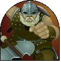</td><td>

**The Long Dwarves**  Hardy and hospitable, the Long Dwarves dwell peaceably in their realm of the Long Mountains, which stretches half the length of the Bloodmarch, from the Mists of Oblivion in the far north to the borders of the Deeping in the south. Olthruda the Bountiful, the King's wife is held hostage in Maranor by the Dark Fey.

</td></tr>
<tr><td>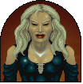</td><td>

**The High Fey**  Possessed of much wisdom, but strange and enigmatic, the High Fey dwell in the Weirdwood in the west of the Bloodmarch, betwixt the Eldmark and the Gelm. Emedrel of the Fire, the High King's daughter, is held hostage in Maranor by the Dark Fey.

</td></tr>
<tr><td>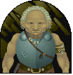</td><td>

**The Deeping Dwarves**  The Deeping Dwarves are a brave and resilient people. Their mountain kingdom, the Deeping, lies to the south of the Bloodmarch, between the Gelm in the west and the Marish in the east. Thalgrima the Betrothed, the King's bride to be, is held hostage in Maranor by the Dark Fey.

</td></tr>
<tr><td>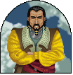</td><td>

**The Gelmings**  Friendly and good-hearted, the Gelmings dwell in the Gelm, in the southwest of the Bloodmarch, south of Weirdwood and the Deeping. Wythran the Weaver, dabbler in the webs of fate and the King's only son, is held hostage by the Dark Fey in Maranor.

</td></tr>
<tr><td>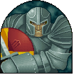</td><td>

**The Dragonlords**  The Dragonlords of Arungor have, over the years earned the trust and friendship of the dragons that dwell in the island's mountains. The Dragonlords are fearsome warriors and their island kingdom in the northeast of the Bloodmarch, off the coast of the Last Northing has seen no war for many a year. Sagrana Goldenwing, the King's sister, is held hostage by the Dark Fey in Maranor.

</td></tr>
<tr><td>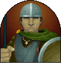</td><td>

**The Athelings**  Proud and warlike, the Athelings dwell in the Lee in the north of the Bloodmarch, betwixt the Witherlands and the Long Mountains. Zenethor the Strong, King of the Lee, is held hostage by the Dark Fey in Maranor.

</td></tr>
<tr><td>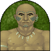</td><td>

**The Uskarg**  The Uskarg, a wild and warlike people, rule the Fallows, a kingdom in the east of the Bloodmarch bordered in the west by Dawnwood and the Marish, in the east by the Great Ocean. Djalina Snowheart, the King's daughter, is held hostage by the Dark Fey in Maranor.

</td></tr>
<tr><td>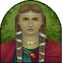</td><td>

**The Eldrin**  A matriarchal people whose history stretches back into the mists of time, the Eldrin dwell in the Eldmark, south of the Witherlands, north of Weirdwood, in the west of the Bloodmarch. Princess Aremela, the Queen's daughter, is held hostage by the Dark Fey in Maranor.

</td></tr>
<tr><td>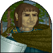</td><td>

**The Dawn Fey**  An ancient, charmed race, pure of heart, strong of limb, long of life, the Dawn Fey dwell in Dawnwood in the heart of the Bloodmarch. To the east lies the Fallows, to the north the Last Northing, to the west the Long Mountains and to the south, the Marish. Aloroth the Fey, the King's brother, is held hostage in Maranor by the Dark Fey.

</td></tr>
<tr><td>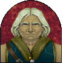</td><td>

**The Arakai**  Proud and pure, strong in battle, simple in love, the Arakai dwell in the Last Northing, in the northeast of the Bloodmarch, between the Long Mountains and the Great Ocean. Further east lies the Isle of Arungor and to the south lies Dawnwood. Kiranda the Wild, the King's daughter, is held hostage in Maranor by the Dark Fey.

</td></tr>
<tr><td></td><td>

**The Kith**  A once proud and powerful people whose days of glory have long since passed, the Kith dwell in the Witherlands in the northwest of the Bloodmarch, south of Midnight, west of the Lee. Mogrik the Witless, Prince of the Witherlands, is held hostage in Maranor by the Dark Fey.

</td></tr>
</table>

# The Characters

| **ID** |  |  | **First** | **Last** | **Race** |
| --- | --- | --- | --- | --- | --- |
| 1 |  |  | Wythran | the Weaver | Gelming |
| 2 |  |  | Arak | the Avenger | Arakai |
| 3 |  |  | Asunai | Ironwing | Uskarg |
| 4 |  |  | Sadlak | the Merry | Long Dwarf |
| 5 |  |  | Itar | the Green | Dawn Fey |
| 6 |  |  | Melinoth | Larkstongue | Dawn Fey |
| 7 |  |  | Rainar | the Besotted | Arakai |
| 8 |  |  | Amarin | Starchaser | Gelming |
| 9 |  |  | Kargrim | the Cautious | Dragonlord |
| 10 |  |  | Morathron | the Sorceror | Arakai |
| 11 |  |  | Guthrane | Oakfist | Arakai |
| 12 |  |  | Djalina | Snowheart | Uskarg |
| 13 |  |  | Grumrud | Slowaxe | Long Dwarf |
| 14 |  |  | Asholeth | the Fey | High Fey |
| 15 |  |  | Boroth | the Wolfheart | Dark Fey |
| 16 |  |  | Ildrar | the Stubborn | Dawn Fey |
| 17 |  |  | Mogrik | the Witless | Kith |
| 18 |  |  | Torgrim | Arrowhand | Dragonlord |
| 19 |  |  | Uthran | the Meddler | Dragonlord |
| 20 |  |  | Marik | Silktongue | Gelming |
| 21 |  | 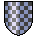 | Haraglai | Stormgut | Uskarg |
| 22 |  |  | Oglim | the Lonely | Long Dwarf |
| 23 |  |  | Aloroth | the Fey | Dawn Fey |
| 24 |  |  | Yrgreth | Deathbringer | Dark Fey |
| 25 |  |  | Stublog | Ironskull | Giant |
| 26 | 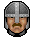 |  | Orabrin | Lionsblood | Kith |
| 27 |  |  | Sparthor | the Patient | Dragonlord |
| 28 |  |  | Cadron | the Bemused | Kith |
| 29 |  | 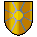 | Brunak | the Wanderer | Arakai |
| 30 |  |  | Skarai | the Dreamer | Uskarg |
| 31 |  |  | Rugrak | Firmaxe | Long Dwarf |
| 32 |  |  | Morgreth | the Unsure | Dawn Fey |
| 33 |  |  | Graleth | the Bitter | Dark Fey |
| 34 |  |  | Muglum | the Handsome | Giant |
| 35 |  |  | Dorok | the Dour | Atheling |
| 36 |  |  | Scirane | the Swift | Dragonlord |
| 37 |  |  | Rorthron | the Wise | Free |
| 38 |  |  | Corlane | the Bear | Arakai |
| 39 |  |  | Moglai | Firewolf | Uskarg |
| 40 | 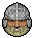 |  | Norgrim | the Rock | Deeping Dwarf |
| 41 |  |  | Jarleth | the Shining | High Fey |
| 42 |  |  | Urskreth | the Vile | Dark Fey |
| 43 |  |  | Borgalug | Bonecrusher | Giant |
| 44 |  |  | Aranor | Boldsword | Atheling |
| 45 |  |  | Moongrim | Longneck | Dragonlord |
| 46 |  |  | Leonik | Leatherhand | Deeping Dwarf |
| 47 |  |  | Storbold | the Scribbler | Arakai |
| 48 |  |  | Arbethor | Greenhand | Arakai |
| 49 |  |  | Luxor | the Moonprince | Free |
| 50 |  |  | Avila | the Cold | Eldrin |
| 51 |  |  | Hoon | the Warrior | Gelming |
| 52 |  |  | Eothor | Sparehand | Atheling |
| 53 |  |  | Snorglum | Bighammer | Giant |
| 54 |  |  | Orgrotha | the Persuader | Dark Fey |
| 55 |  |  | Forthar | the Hunter | Atheling |
| 56 |  |  | Joruk | Redfist | Atheling |
| 57 |  |  | Var | the Swordsman | Gelming |
| 58 |  |  | Morkin | Prince | Free |
| 59 |  | 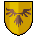 | Carithila | Queen | Eldrin |
| 60 |  |  | Garfin | Quicklip | Eldrin |
| 61 |  |  | Zenethor | the Strong | Atheling |
| 62 |  |  | Gothrum | the Glum | Giant |
| 63 |  |  | Skyrdreth | Iceheart | Dark Fey |
| 64 |  |  | Lanklin | the Boaster | Giant |
| 65 |  |  | Holdar | Longeye | Uskarg |
| 66 |  |  | Aramila | the Seer | Arakai |
| 67 |  |  | Arin | LorBlood | Free |
| 68 |  |  | Mana | the Huntress | Eldrin |
| 69 |  |  | Rorlbar | the Poet | Gelming |
| 70 |  |  | Garamor | the Fat | Atheling |
| 71 |  |  | Borlum | the Happy | Giant |
| 72 |  |  | Akrith | Bloodhand | Dark Fey |
| 73 |  |  | Godrold | Heavyhand | Arakai |
| 74 |  |  | Darath | the Lion | Uskarg |
| 75 |  |  | Parik | the Miser | Uskarg |
| 76 |  |  | Merithel | of the Lake | Arakai |
| 77 |  |  | Aremela | Princess | Eldrin |
| 78 |  |  | Farlik | Whiteknife | Long Dwarf |
| 79 |  |  | Corleth | of Corelay | Free |
| 80 |  |  | Toraneth | the Cruel | Dark Fey |
| 81 |  |  | Dargrith | the Butcher | Dark Fey |
| 82 |  |  | Ogrin | Woodenblade | Dawn Fey |
| 83 |  |  | Arag | Drythroat | Dawn Fey |
| 84 |  |  | Justrik | the Hawk | Arakai |
| 85 |  |  | Sharila | Suresword | Kith |
| 86 |  |  | Galagrim | of the Flame | Dragonlord |
| 87 |  |  | Jaranor | the Hasty | Dragonlord |
| 88 |  |  | Anderlane | of the Arakai | Arakai |
| 89 |  |  | Urgoreth | the Despiser | Dark Fey |
| 90 |  |  | Mirgrath | the Black | Dark Fey |
| 91 |  |  | Mograk | Rustaxe | Deeping Dwarf |
| 92 |  |  | Taroleth | the Jester | Dawn Fey |
| 93 |  |  | Arfold | Longtooth | Gelming |
| 94 |  |  | Dorgrun | Roughhand | Dragonlord |
| 95 |  |  | Molicor | the Kind | Arakai |
| 96 |  |  | Igral | Mouseheart | Arakai |
| 97 |  |  | Orimund | the Resplendent | Uskarg |
| 98 |  |  | Crun | the Weasel | Long Dwarf |
| 99 |  |  | Faramoth | the Solemn | High Fey |
| 100 |  |  | Ulgrim | the Weary | Deeping Dwarf |
| 101 |  |  | Miranar | Fairhand | Dawn Fey |
| 102 |  |  | Ulgrud | the Treacherous | Long Dwarf |
| 103 |  |  | Elgrena | the Gracious | Dawn Fey |
| 104 |  |  | Alagrim | Ironaxe | Long Dwarf |
| 105 |  |  | Karahar | the Wistful | Gelming |
| 106 |  |  | Oragrane | the Fearless | Dragonlord |
| 107 |  |  | Marathor | the Splendid | Atheling |
| 108 |  |  | Barag | the Fierce | Uskarg |
| 109 |  |  | Golgud | the Reluctant | Deeping Dwarf |
| 110 |  |  | Ilareth | the Chosen | High Fey |
| 111 |  |  | Torbrith | Swiftfoot | Long Dwarf |
| 112 |  |  | Slorum | the Smug | Giant |
| 113 |  |  | Samara | Wildheart | Dawn Fey |
| 114 |  |  | Hilgor | the Meek | Giant |
| 115 |  |  | Zalnor | Sourspleen | Kith |
| 116 |  |  | Melgran | Dragonsword | Arakai |
| 117 |  |  | Khalak | the Blue | Uskarg |
| 118 |  |  | Boragrim | Sharpaxe | Deeping Dwarf |
| 119 |  |  | Melkrith | Nightshade | High Fey |
| 120 |  |  | Oscruth | Loosehead | Uskarg |
| 121 |  |  | Volgor | the Sure | Long Dwarf |
| 122 |  |  | Talmar | the Quiet | Kith |
| 123 |  |  | Olog | the Friendly | Giant |
| 124 |  |  | Olagrum | the Steady | Giant |
| 125 |  |  | Harumbar | the Unhappy | Dawn Fey |
| 126 |  |  | Thorgran | Wildsword | Uskarg |
| 127 |  |  | Aluthrim | the Bold | Deeping Dwarf |
| 128 |  |  | Alargrith | Warhelm | High Fey |
| 129 |  |  | Gorolan | the Benign | Atheling |
| 130 |  |  | Ilvar | the Penitent | Atheling |
| 131 |  | 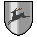 | Araleth | the White | Free |
| 132 |  |  | Arithel | the Joybringer | High Fey |
| 133 |  |  | Emedrel | of the Fire | High Fey |
| 134 |  |  | Andremar | the Starborn | High Fey |
| 135 |  |  | Galdreth | the Fair | High Fey |
| 136 |  |  | Sagrana | Goldenwing | Dragonlord |
| 137 |  |  | Elina | the Enchantress | Uskarg |
| 138 |  |  | Tarella | the Intrepid | Dragonlord |
| 139 |  |  | Oraina | the Placid | Arakai |
| 140 |  |  | Karelda | the Carefree | Uskarg |
| 141 |  |  | Imirel | Starblade | Deeping Dwarf |
| 142 |  |  | Ylanda | the Wishful | High Fey |
| 143 |  |  | Morgrissa | Hammertongue | Giant |
| 144 |  |  | Trantana | the Grand | Atheling |
| 145 |  |  | Oglissa | the Rose | Giant |
| 146 |  |  | Melinissa | the Sweet | Giant |
| 147 |  |  | Olthruda | the Bountiful | Long Dwarf |
| 148 |  |  | Thalgrima | the Betrothed | Deeping Dwarf |
| 149 |  |  | Elessa | of the Mists | Gelming |
| 150 |  |  | Ulene | Quietheart | Dragonlord |
| 151 |  |  | Sherinar | of Shadows | Eldrin |
| 152 |  |  | Mirithel | the Warm | Arakai |
| 153 | 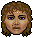 |  | Kiranda | the Wild | Arakai |
| 154 |  | 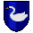 | Galahar | the Calm | Golden Fey |

# The Quests

<table>
<colgroup><col style="width:100px"><col></colgroup>
<tr><td>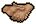</td><td>

**Recruit someone**  Touching this symbol will take you to a gallery of character portraits. Simply touch the face of the person you wish your character to try and recruit. Note that this is not the same as recruiting warriors to form an army. When you  have succeeded in recruiting them, they will become part of the Alliance and may be influenced by the Moonring, allowing you to command and watch them. They are also automatically joined to the character who recruited them, forming a Fellowship.  Not all characters will want to be recruited. Some may refuse your advances, usually for personal or political reasons.

</td></tr>
<tr><td>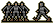</td><td>

**Join someone**  This will take you to a catalogue page showing a gallery of portraits. Touch the portrait of the character you wish to join. Upon joining, you create a fellowship. As a result, the character who was joined becomes leader of the Fellowship. (See 'Fellowships' for more details).  However, if they are already in a fellowship then your character will become a member of the same fellowship.

</td></tr>
<tr><td></td><td>

**Attack someone**  Choosing this symbol will take you to a catalogue page showing a gallery of portraits. Now touch the portrait of the person you wish to attack. Your character will then attempt to locate and attack them.

</td></tr>
<tr><td></td><td>

**Rescue someone**  Touching this symbol will allow you to set a quest to rescue Luxor.  If the character finds other hostages en route then they will also be rescued. A rescued character will be given a dragon to ride once they are free. The news of their escape will spread quickly across the realms and give the Alliance the chance to recruit more people to the war against Boroth. Rescued hostages will immediately head for their own realm and land within the Blood March. Only Arin Lord Blood and Corleth of Corelay can attempt to rescue Luxor, as they begin the game within the Dark Citadel. If they leave the Citadel, the rescue quest will become unavailable and the chance to rescue hostages (including Luxor) will be lost.  You can also directly control Arin Lord Blood and Corleth of Corelay inside the Dark Citadel. If either of them encounters a hostage, approach the hostage and press F10 to enact the rescue.

</td></tr>
<tr><td></td><td>

**Shadow someone**  Choose the person you want to shadow (secretly follow) from the gallery of portraits. Your character will then locate the person and follow them from a discreet. distance.

</td></tr>
<tr><td>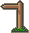</td><td>

**Goto somewhere**  This allows you to send the character to a particular location on the map without needing you to take direct control Touch this symbol to be taken to the map page. Now touch the destination on the map. A row of dots will indicate the journey. If the character cannot reach the destination from where they are, you will be told. If the destination is acceptable, touch the portrait in  the bottom right hand corner of the map page to confirm it. You are then taken back to that character's page. Once the character has reacted the destination, they will revert to waiting again.  If a character is tired en route, they will attempt to seek shelter and rest before continuing. Their quest will temporarily change to seeking shelter. Once refreshed and brimming with energy, they will revert to their original quest. If they cannot find any shelter, they will rest out in the open instead

</td></tr>
<tr><td></td><td>

**Guard somewhere**  You can touch this symbol and then choose and confirm a destination on the map screen (as described in ‘Go to somewhere’). When the character reaches the destination they will stand guard and automatically attack if anyone or anything comes within close distance. Warriors posted into a garrison already guard buildings, so characters can only guard specific regions within the Blood March.

</td></tr>
<tr><td>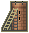</td><td>

**Seize stronghold**  This will send the character to a building in the realms and then make them proceed to attack. Obviously it would make sense to have some warriors with them to ensure a better chance of success (See Recruiting Warriors' for more details).  If the holder of the stronghold is not in residence, their Captain of the Guard will defend the building on their behalf. Once seized, the character will revert to waiting in the building for further orders. The flag of their ruler (either their Monarch, or Luxor if they belong to the Alliance) will then be hoisted above the battlements for all to see.  If you try to enter a stronghold held by an enemy you will be told how many enemy warriors reside within. It's then up to you whether you seize the building (F3 whilst directly controlling or set a seize quest).

</td></tr>
<tr><td>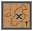</td><td>

**Find something**  This symbol will take you to a catalogue showing all the ancient artefacts found within the Blood March. You can choose which artefact to find by touching its symbol on this page. Your character will then attempt to find the artefact. It will either be lying around somewhere in the realms, or be in the hands of someone else. If the latter, the Take something quest symbol will be available, and you should set a Take' quest instead. To conclude the find quest, your character will take the artefact once they have located it.

</td></tr>
<tr><td></td><td>

**Take something**  This symbol will appear when an artefact is held by a character, as opposed to just lying on the ground somewhere in the Blood March.  Choose the artefact you wish to take. Your character will then go off and find then take the artefact. This will usually involve a conversation (see ‘Talking' for more details) in the first instance  This command has only a single, restricted purpose. Merithel of the Lake holds the valued Bloodbringer sword, an artefact of limitless value when wielded in combat by a seasoned hero. After she is recruited by Anderlane of the Arakai, you can "borrow" the Bloodbringer from her by using this command.

</td></tr>
<tr><td></td><td>

**Destroy something**  Touch this symbol then choose the artefact to destroy, Your character will then search the realms and when they have located the artefact. they will attempt to destroy it.

</td></tr>
<tr><td></td><td>

**Wait**  Characters who haven't been given a quest will wait by default. Similarly, characters who have completed a quest will revert to waiting until a new quest is assigned to them.  Impatient characters may go olf on their own quests if they are left waiting too long!  Once a quest has been set by you, the character will begin to carry out their orders. If you change your mind about making a new quest, simply touch the character portrait in the bottom left corner again. This must be done before you choose a quest symbol, else you will have lo go through the motions of setting a wait quest.

</td></tr>
</table>

# The Strategy Guide

Notes from the gameplay strategy guide by Ronald Wartow.

Much has happened in the Land of Midnight and its mammoth neighbour to the east, the Blood March:

- Boroth the Wolfheart, leader of the Dark Fey, has captured the head of the Land of Midnight's Royal House of the Moon, and the Alliance, Luxor the Moonprince.
- Luxor is imprisoned in Boroth's headquarters, the Dark Citadel of Maranor, in the Blood March realm of Marish.
- 7 Twelve high-born hostages from each of the other 12 Blood March realms are also imprisoned in the Dark Citadel.

The remaining members of the Alliance are Prince Morkin and Corleth of Corelay, and Luxor's sons, Arin Lord Blood, Araleth the White, and Rorthron the Wise. 

- Corleth and Arin have entered the Dark Citadel to find and rescue Luxor and the hostages. 
- Prince Morkin and Araleth the White are about to strike out from the Castle of Corelay in Midnight, cross the border into the Blood March, and mount a Campaign against Boroth and the Dark Fey. 
- Rorthron the Wise is in the northern reaches of the Blood March searching for a long-lost son of Motkin, Anderlane of the Arakai.

## Success and Failure in the Lands of Midnight and the Blood March

You must defeat Boroth the Wolfheart and capture the Dark Citadel of Maranor within 365 days from the date you first begin play. The game automatically ends if victory is not achieved by that inflexible time limit. On Day 366, you're history!

## Victory Conditions

- Win - Destroy Boroth the first time in the Blood March. Attack the Dark Fey guarding the Dark Citadel of Maranor, now led by Boroth reincarnated into a ghastly wraith. Defeat Boroth a second time. The Dark Citadel is destroyed on Boroth's demise.
- Win - Assault and occupy the Dark Citadel before killing Boroth. Demolish Boroth when he attempts to retake the Dark Citadel. This eliminates the wraith conversion and requires you to fight Boroth only once to win.
- Lose - Corleth, Morkin, Anderlane, and Araleth all die. Boroth wins.
- Lose - Castle Corelay, in Midnight, cannot fall into the evil hands of Boroth the Wolfheart or any other of Boroth's henchmen, the Dark Fey.

## Hostages

| **Hostage** | **Race** | **Home Castle** |
| --- | --- | --- |
| Aloroth the Fey | Fey | Carafel |
| Djalina Snowheart | Uskarg | Theodel |
| Emedrel of the Fires | High Fey | High Fey |
| Kiranda the Wild | Arakai | Erefar |
| Luxor the Moonprince | Free | Corelay |
| Melinissa the Sweet | Giants | Athruk |
| Mogrik the Witless | Kith | Erifel |
| Olthruda the Bountiful | Long Dwarves | Farwain |
| Princess Aremela | Eldrin | Arelban |
| Sagrana Goldenwing | Dragonlords | Faragor |
| Thalgrima the Betrothed | Deeping Dwarves | Zaragorn |
| Zenethor the Strong | Atheling | Varorn |

## Exploring the Dark Citadel

When the game begins, the Dark Citadel has over 10,000 Dark Fey warriors, and it is the headquarters of Boroth the Wolf-heart's malevolent operations. This imposing and frightening structure is also a stuffy prison dungeon, a slammer of the most awful kind.

When Boroth begins his quest to destroy the Castle of Corelay in Midnight, he leaves Toraneth the Cruel in charge.

This evil one is only slightly less ruthless, vicious, and treacherous than Boroth.

Corleth of Corelay and Arin Lord Blood, through bravery and cunning, manage to re-enter the Dark Citadel after they escape. Their task — to rescue the Moonprince and as many other hostages as possible — is an extremely daunting one.

Until hostage release, Prince Morkin's goal to gather an army to do away with Boroth will be delayed appreciably.

Realms do not dare risk the life of their hostages and the wrath of Boroth by aiding the Prince before the hostages are released.

When a hostage is released, just outside the Dark Citadel a majestic dragon awaits your pleasure, courtesy of the Dragon-lords of Arungor. Released hostages climb onto the dragon's back quickly, beginning the long, pleasant flight back to their home realm and stronghold.

Speed is always of the essence in Lords of Midnight. Exploring the Dark Citadel through direct control of Arin Lord Blood or Prince Morkin (instead of leaving the computer in command) will reduce the time it takes to find and rescue hostages by threefold. The faster hostages are released, the faster they will become Alliance members directly controllable by the player.

If the Dark Citadel is explored without direct control of Arin Lord Blood and Corleth of Corelay, the process of hostage release will take longer—up to 10 months.

Hostages are released at rates impossible to calculate or predict. The rate appears to be entirely random. In some games, Luxor the Moonprince was released within two weeks of Day One. In others, he wasn't released until eight months into the game. Usually, about four to six hostages are released, then Luxor the Moonprince, then the remainder of the hostages. Unfortunately, there is absolutely no specific guideline or exact method for hostage discovery and rescue from game to game.

## Rescuing Hostages

Neither Corleth or Arin tire very much. If you control other characters outside the Dark Citadel, Corleth and Arin are perfectly capable of exploring on their own, finding hostages, and rescuing them.

Early in the game, finding and liberating hostages should be your first priority. After sending Prince Morkin and Araleth on their first quests, switch to Corleth of Corelay or Arin Lord Blood. Take immediate command of either hero and start looking for the hostages.

Caution: Remember, Corleth and Lord Blood are the only characters who can enter the Dark Citadel and search for hostages. Any others will fall victim to the 10,000 evil minions of the Citadel guard.

## Guardian Trolls

When losing combat agains a troll in the dungeons, the lord is transported to some random location within the dungeon. However, Luxor will be killed.

## Liberating Luxor

When Luxor is liberated, like all the other hostages, he can mount a waiting dragon. His rescue, or death for that matter, triggers a cataclysmic effect in Midnight. Over 5,000 loyal Warriors of the Free descend on the Castle of Corelay. Some unseen magic must be involved here, because the troops gather within four seconds after Luxor's liberation or demise. Go figure!

As much as it pains me to mention this, do not lick your chops at the prospect that Luxor should lead the final assaults on Boroth the Wolfheart and the Dark Citadel of Maranor.

True, according to his personality traits, he does possess the qualifications of a superb leader. Zenethor the Strong should lead and conquer the ultimate bad guy and his crib (that is, the Dark Citadel). Only Zenethor, of all the game's characters. is both a superb leader and a mighty warrior.

# Hints and Tips

## RESCUING PRISONERS

Rescuing prisoners should be a high priority in the game. Without the prisoners of the realms at your side, your quest for the Blood March will be your last quest! Rescued prisoners are initially under your command but do not owe you allegiance since they have not been recruited to join your Alliance. While their allegiance is to their home realm, rescued prisoners will be under your command in battle against the Wolfheart. Rescued characters are quite important due to the fact that they are able to recruit from all the Castles and Citadels that carry  their realms standard.

## SMART RESCUING

First and Foremost, leave Coreleth of Corelay and Arin Lord Blood in the Dark Citadel of Maranor until all the prisoners are rescued. If you rescue the characters early in the game, they will no longer be able to re-enter the dungeons and rescue characters. Early in the game  it is best to take direct control of one of the characters and lead them through the Dark Citadel. Since the AI will randomly pick routes through the Dungeon intersection and will many times completely miss a prisoner. The dungeon has a main route that can easily be identified by it's similarly textured ceiling, floor, and walls. Searching all corridors that branch from the main route is the best way to locate prisoners. You need to be methodical in your search, as finding prisoners isn't the easiest of tasks. A good idea might be to draw a dungeon map to aid you in a through search of the Dark Citadel.

## RECRUITING SYSTEM

Recruiting works on a point based system, based on the recruiter and Non-Player Character's (NPC's) personality attributes. There are 64 personality attributes within the game, 32 good, 32 bad. For every attribute that the recruiter and the NPC have in common, such as Loyal vs. Loyal, 1 point is added towards the total. For every attribute that is in opposite, such as Brave vs. Cowardly, 1 point is subtracted from the total. Attributes that have nothing in common with will be counted as no points.
The recruiter must have 2 points in his or her favour to bring the NPC around to his or her cause. If the prisoner from the NPC's realm has already been rescued from the Dark Citadel, you will only need 1 point in order to recruit that character. However, if the total amounts to 0 points, the NPC will refuse to be recruited. If at the end of the point calculation, the total is negative (-1 or lower), the NPC will be offended, and will attack the recruiter. If an NPC you are trying to recruit is being difficult, you may have to find another NPC that you are able to recruit. This other recruit may be able to recruit the original NPC you wanted. Who you recruit into your Alliance is a large part of the game's strategy and may ultimately determine your success or failure in the game.

## SMART RECRUITING

The smart thing to do is look at the personalities of the recruiter and the possible prospect for your cause. Add the points up, (remember to factor in the status of the prisoners) and you will safely be able to see what the probable outcome of your recruit attempt.
Your first selection for recruiting should be the lords of the Citadels in the realms surrounding your start position. This will gain you an instant flow of troops since Citadels attract troops  at double the rate of Castles.

## COMBAT

Intelligent combat is the key to victory in warfare. If your character or fellowship's army outmatches that of an enemy NPC and your are not skilled in manual combat, then the best strategy is to set the game to Time Race On. The computer AI will then go through a series of combat routines that will often achieve victory for your army. Your chances for success are greater if your have a large army. Even if victorious, you must expect your army to take casualties. If your army is smaller (or if you are skilled in manual combat) then manual combat is the best strategy. In manual combat you control the actions of your character, swinging your sword and parrying attacks. Often, manual combat results in your army taking less casualties than when you allow the AI to direct your army's attacks. Additional factors into your success in combat are Artefacts, Castles and Citadels and Character Personalities.
Artefacts can add or subtract bonuses to combat, depending on the time that is being wielded and who is wielding it.
Castles and Citadels add bonuses to defence while troops occupy them. Castles and Citadels either triple or quadruple, respectively, the amount of troops garrisoned within them (e.g. The Citadel of Beomir has 500 troops within it's walls. If the Citadel is attacked the troops will defend as if they were 2,000 troops).
Character personalities play a part in combat also. A hero on a whole is more combat orientated than a warrior. A character that has Mighty Warrior as a personality attribute fights with the combat strength of 100 troops. However, if a character has Feeble Warrior as a personality attribute, they fight with the strength of 25 troops. All other characters fight with the strength of 50 troops in combat.

## SMART COMBAT

Learning manual combat should be one of your first goals. In the long run, it will save you troops and make combat easier throughout the game. If you outnumber an enemy by 3 to 1, odds 
are that the AI will win the battle for you. When dealing with the defence of Keeps and Boroth the Wolfheart, the best tactic is to withdraw all troops garrisoned within a Keep before Boroth and his army. Better to retreat and return to fight another day than to die in vain against unbeatable enemies.

## PATHS TO POWER AND GLORY

Here are some proven victory strategies

### THE DOUBLE PLAY

Have a character with a large amount of troops take over the surrounding Castles and Citadels. As time goes on the Castles and Citadels that the character has taken over will begin to attract troops to your standard. Have another character of your alliance follow in your wake, stopping at each Castle and Citadel, recruiting all the troops garrisoned there. This tactic will steadily increase the size of your character's armies.

### CAT AND MOUSE

Boroth the Wolfheart will systematically take over every Castle and Citadel within a realm. He will only leave to rage across another realm when he has secured his holdings. Once way to keep him occupied is to gather a force large enough and follow Boroth the Wolfheart through his rampage. As he seizes a Keep and moves on towards another, you recapture it. In this way you can keep Boroth in one realm while your Alliance travels across the Blood March recruiting enough troops to remove the blight of Boroth from the land.

### TAKING THE THRONE

Attacking Boroth the Wolfheart in the Blood March will cost you many needless losses since Boroth is returned as a wraith in the Dark Citadel and is once again defended by a horde of troops with the defence bonus of Citadels. Your best tactic is to march with 35,000+ troops, all the artefacts, and a Mighty Warrior as your Fellowship Leader to the Dark Citadel of Maranor and seize it. Once you seize the Dark Citadel, garrison it with Alliance troops. Boroth the Wolfheart will then return to reclaim his lost Citadel. In the ensuing combat your Alliance army will receive the defence bonus for the Dark Citadel of Maranor and should be able to defeat Boroth. 

Well that is it ...
Good luck in your quests!

Tips: Nathan Caroland - Domark Testing Department

# Letter from Rorthron

From Rorthron the Wise, Guardian of the tower of the Moon, to my good and noble friend Prince Morkin, Lord of Corelay, greetings!

Even as I write, I know that you march again to war against a greater evil than Midnight has ever before faced. Just as I have given your father counsel in past times of peril, so must I give you my counsel now, for upon your shoulders falls the heaviest of burdens. I pray that you take heed of my scant words of advice - although I cannot see all, I can see much that is hidden to others.

Know you first that, as chance would have it, I am already within the blood March in the realm of the Lee on no idle journey. I travel to the Last Northing and a land called the Crimson Mountains in search of Anderlane of the Arakai. Morkin, this boy is your son, conceived in Kahangrorn in the Icemark when you were hostage to the Heartstealer’s bewitchments. Though he knows nothing of it yet, Anderlane is you son and Shareth’s!

I must be brief but by Shareth’s dark powers, the boy was born to a surrogate mother, Cirithel of the Crimson Mountains, and has been raised and nurtured by her as though he were her own flesh and blood. The Lord of Imorthorn, our ally and friend in the War of the Icemark, vouches that there is naught but good in the boy. In my heart, I know that this Anderlane is vital to our success.

From the Witherlands to the Delve, the realms of the blood March are in mortal fear of Boroth the Wolfheart, who holds each to ransom with his clutch of hostages. Precious few lords of the blood March will flock to your banners whilst their kings or princes lay in Boroth’s dungeons but Anderlane is different He is your son, he is Luxor’s grandson, he is Corleth’s brother, he is a prince of Midnight and surely, when I tell him of this, he will rally to your cause and march against the Wolfheart with all the warriors he can muster. More than this, who better than a lord of the Arakai to persuade other lords of the Last Northing to help us? From this realm alone we might raise a mighty army once Anderlane is with us! Use his help wisely.

Now to other matters. You will know already that your son Corleth and the young Arin Lord blood are at large within the Dark Citadel of Maranor seeking to rescue the Moonprince. You dare not rouse Midnight whilst Luxor is still in Boroth’s power but once he is free warriors of Midnight will gather at the Castle of Corelay in a mighty army. To use this army as swiftly as possible, it will need a leader, so look to Corelay when Corleth and Arin get closer to their goal. Then, keep yourself or one of your allies close to the Castle of Corelay or, failing that, ready on dragonback to return there and lead the army of Midnight forth against Boroth.

Do not expect Corleth and Arin to find Luxor swiftly. The dungeons of Maranor are a vast labyrinth and, likely as not, the boys will free other hostages well before they free the Moonprince. If a hostage is freed, seize the opportunity at once! One of your allies should move as swiftly as possible to that hostage’s realm, where the once reluctant lords will now be eager to join your cause.

As to yourself and the Lord of Dreams, you must seek out whatever help you can find as swiftly as you can. For the moment, there is nothing to be gained by travelling together. You should each go your separate ways, trying to recruit new allies in the kingdoms you travel through. Persuasion, not force, must be your watchword at first. Though most lords will be unwilling to help you with the life of their prince or princess at risk, in each realm you may find one lord of stouter heart who can see that the Wolfheart must be resisted. But do not attempt conquest like Boroth or you may find a whole kingdom set against you.

Even now, as I write, Boroth is marching at the head of a mighty army. As yet, I cannot see the finer details of his campaign but I tell you this at least, that he plans to conquer the entire Blood March, realm by realm. The Wolfheart will not be foolhardy. He will attack just one kingdom at a time, seizing every stronghold within its borders, before turning his attention to another neighbouring kingdom.

Thus he hopes to minimise resistance to him by keeping peace with others whilst he devours one victim at a time. And even that realm will be in disarray, the king or prince unwilling to do nothing but defend his own citadel lest his hostage kin be slain. His lords will fight bravely to defend their own or neighbouring castles and even counterattack the Wolfheart but there will be little concerted resistance.

When a kingdom falls under his power, the Wolfheart will then attack another nearby kingdom, then another and another and the will creep inexorably towards Midnight and Corelay. And as he gains stronghold after stronghold, his power will grow until he is unassailable, even by the whole might of Midnight.

Yet there is a glimmer of hope even in this. Wherever Boroth strikes, the lords of that land will be keener to join your cause and do battle against the ravager of their realm. To take best advantage of this, you and the Lord of Dreams should take yourselves swiftly southeast towards the borders of the Marish where Boroth’s wars will begin. Then you can move quickly to any realm he chooses to attack, recruiting its hard-pressed lords and forestalling the Wolfheart for a while.

Seize back as many of the strongholds he has captured as you can. In these strongholds lie his strength and from these strongholds he will draw reinforcements for his army of conquest. Likewise, where we hold a stronghold in place of Boroth, a steady trickle of warriors from far and wide will gather there to our banners and slowly swell our ranks rather than his.

Take some care with the garrison of strongholds. Leave too many warriors there and they will be wasted in idle waiting but leave too few and they be lost in sudden attack. Once you have allies from the Blood March, be aware that there are some who will not stand side-by-side in the same garrison. The peoples of the Blood March remember their past disputes with much passion.

The Dragonlords of Arungor will never stay in the same stronghold as the Giants of the Delve, nor the Deeping Dwarves with the Long Dwarves, nor the Fey of Dawnwood with the Gelmings. nor the Eldrin of Eldmark with the High Fey of Weirdwood, nor the Uskarg of the fallows with the Kith of the Witherlands, and nor the Arakai of the Last Northing with the Athelings of the Lee. Such are the ways of the Blood March.

And now a word of warning; do not press Boroth too closely until the Moonprince is set free! If Boroth were to be slain with Luxor still imprisoned in Maranor, your father would surely be executed in revenge by the Dark Fey. I fear that Boroth’s death will not be the end of it. His lords and minions are as bloodthirsty and ambitious for slaughter as he and once he is removed. I would hazard that they will pour forth from the Marish like ravenous wolves, each seeking his own victims, beware of killing Boroth until we are strong enough to resist such an onslaught. I have a fear about this that I cannot fathom yet.

How should we proceed then? This war can turn many ways and doubtless there are an equal number of ways to defeat Boroth. At first, the Wolfheart will be campaigning far away and this gives us some breathing space to gather our strength. Leave the task of recruiting Anderlane to me and set yourself and the Lord of Dreams to recruit such as you can find in other realms, moving south and east as you go. And whilst these bloodless quests are underway, bend all your thoughts and powers to your son Corleth and Arin Lord Blood in the Dark Citadel. Your personal guidance while time does not press so heavily upon you will lead them more swiftly through the maze of dungeons and hasten the release of hostages and the Moonprince himself. When Corleth tires, bend your thoughts to Arn and then when he tires bend your thoughts back to Corleth. Spare little thought for yourself, myself and the Lord of Dreams - our tasks at the beginning are less arduous

As hostages are found and allies found, the emphasis must change. Now you must busy your thoughts with recruiting yet more allies and amassing armies. Set each new recruit to recruit another - one of his or her own race will be likeliest to be persuaded. And turn your thoughts to challenging Boroth in his latest war- a kingdom under attack is a kingdom where you will find eager recruits. You will have less time now to offer personal guidance to Arin and Corleth, but me them such time as you can, Luxor’s rescue is vital before Boroth is truly assailed!

Once I have brought Anderlane to our banners. I will voyage to the Isle of Arungor to seek what help I can from the Dragonlords and to find me a dragon that I might travel more swiftly thenceforth to wherever I am needed most urgently. Urge Anderlane to raise what help he can within the Last Northing.

When Luxor is free at last, the final battle begins! I favour a two-pronged attack, gathering our scattered armies together along the way. The first army should strike at Boroth directly but a second should be already on its way to the Dark Citadel of Maranor to forestall the mayhem that might be unleashed on Boroth’s defeat and demise.

There is something else that I must mention, though I am loathe to do so. It is not just the Moonprince’s life that is at stake but the whole fate of the land of midnight. If by ill-chance or our mishap, your father is slain before we can free him, we must hold back our tears and fight on. Midnight will be roused as never before and the mightiest of armies will pour forth from Corelay against the Wolfheart. Your father will guess as much. If all goes ill for us, he may attempt an impossible unarmed escape, sacrificing himself so that the might of Midnight can be brought to bear against our foe. And, if the worst comes, that may be our only hope. If that is his judgement, you will not be able to stop him. Let us pray that things do not come to that.

One last thing - beware of wolves! In the Blood March, wolves are Boroth’s creatures and scout ahead of his armies. If you spy a wolf, a Dark fey army will not be far behind!

Seize the moment, roam far and wide, gather all strength we can, be swift of foot, strong of heart and quick of mind and victory will be ours! I bid you farewell, for now. We may meet before this is over and I remain, as ever, your friend and counsellor.

Rorthron

Game Conditions

You start with Morkin, Araleth, Rorthron, Corleth ( jnr ), and Arin.

Corleth and Arin are in the Dark Citadel having recently been set free.

Winning involves eliminating Boroth while keeping one of the house of Moon alive ( Luxor, Morkin, Corleth, Anderlane (Morkin’s son) )

"If Luxor escapes from the Dark Citadel then the free in Corelay with rally their warriors to the cause” - I don’t know what this means. I can only presume that some extra armies are generated once Luxor is free in order to boost numbers ready for a possible attack against boroth.

Boroth wins by killing the 4 House of Moon characters.

You need to rescue other hostages of other races in order to get them to join you.

Boroth will take Citadels and Castles on his way to invading Midnight. 

You must take these back to slow him down.

After 12 months game time - all hostages are killed.

If you kill Boroth he becomes a wraith in the Dark Citadel, so you must take the citadel and kill him.

NPC lords perform the quests which I suspect are the ones to do with protecting their and their neighbouring realms/regions.

The obvious main difference is that you can assign tasks to your lords and let them get on with it. I think this is important otherwise you can end up with the DDR scenario where you have too many characters to control. In the original this was part of the realtime process. You also get a notification and the ability to intercept should any character need it. My intention was to reproduce this, but obviously tailor it to the turn based mechanic. So you take your turn, press night, your ‘ai’ lords get their turn, and then the NPC lords take their turn. For simplicity you’d get notification for the lords that need ‘assistance’ at the beginning of your next turn.

You also have hands on with the fighting - I need to look into what this actually meant, and see if any of it needs replicating or not. 

## Purposes

- NO_PURPOSE
- DEFEND_HOMELAND
- DARK_FEY
- RANDOMLY_WANDER
- BE_A_HOSTAGE

## Reactions

- RETURN_HOME
- STAND_FIRM
- TAKE_BACK_STRONGHOLD
- ATTACK_ENEMY
- HELP_NEIGHBOUR
- RETREAT
- GATHER_STRENGTH
- COUNTER_THREAT
- LEND_SERVICE

## States of war (for lands)

- LS_AT_PEACE
- LS_TROUBLED
- LS_THREATENED
- LS_MENACED
- LS_IN_DANGER
- LS_IN_PERIL
- LS_UNDER_ATTACK
- rLS_SUBJUGATED

## States of war (for realms)

- RW_AT_PEACE
- RW_THREATENED
- RW_UNDER_ATTACK
- RW_SUBJUGATED

## State of realm

- RS_UNFETTERED
- RS_AT_RANSOM
- RS_BLOOD_FEUD
- RS_INTERREGNUM

## Who

- ENEMY
- SELF
- NEIGHBOUR
- LEADER
- QUEST_SUBJECT
- LIST

## Quests

- QRECRUIT
- QJOIN
- QKILL
- QRESCUE
- QFOLLOW
- QGOTO
- QGUARD
- QSEIZE
- QFIND
- QTAKE
- QDESTROY
- QREST
- QUNDER

## Quest parameter types

- LAST_PARAMETER
- OWN_STRONGHOLD
- GO_SAMELAND
- GO_HOMELAND
- GO_ADJACENT_LAND
- GO_NEARLAND

## List evaluation conditions

- LC_NEIGHBOURS
- LC_NEARLANDS
- LC_HOME_REALM_LANDS
- LC_ALL_LANDS
- LC_ADJACENT_NEIGHBOURS
- LC_LANDS_IN_NEIGHBOUR_REALMS_TO_ME
- LC_QUEST_SUBJECT
- LC_KINGDOM_LANDS
- LC_RETURN_HOME
- LC_HELP_NEIGHBOUR

## List subtraction routines

- SC_GTE_UNDER_ATTACK
- SC_COWARDLY
- SC_NOT_IN_NEARLAND
- SC_NOT_THREATENED
- SC_NOT_AT_PEACE
- SC_NOT_AVAILABLE
- SC_NOT_IN_HOMELAND
- SC_NOT_DEFENDING_HOMELAND
- SC_RETREATING
- SC_NOT_IN_DANGER
- SC_STANDING_FIRM
- SC_NOT_RETREATING
- SC_NOT_UNDER_ATTACK
- SC_ANOTHER

# Recruitment Quest

- wake_up
- store_charac_quest
- find
- goto
- reset_maybe
- check_not_dead
- move_outside_maybe
- move_inside_maybe
- is_about_to_recruit
- delay_1_frame
- delay_1_frame
- recruit
- cancel
- panic x 8

# Quest States

## wake_up

IF we are inside a building THEN

	remove from building

END IF

Move to next state

set continue quest flag

## store_charac_quest

IF quest type (obj_qtype1) is qt_char THEN

	COPY obj_qtype1 to obj_qtype2

	COPY obj_qdat3 to obj_qdat4

END IF

Move to next state

set continue quest flag

## find

## Invalid State

check quest state bit 08000h - this is invalid state

if the bit is set then we need to set an emergency state