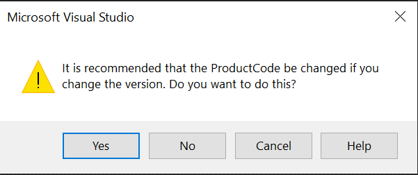

# Building on Windows


## For both Lords Of Midnight and Doomdark's Revenge

### Install CMake

- Download CMake installer (3.31+) from: https://cmake.org/download/
- Install making sure CMake is added to your path during installation.

### Install Visual Studio 22

- Download Visual Studio 22 community edition from: https://visualstudio.microsoft.com/
- Install making sure that you select "Game development with C++" from Workloads tab, "Microsoft Visual Studio Installer Projects" from Individual Components tab.

### Install axmol

- Follow the axmol install instructions from:https://github.com/axmolengine/axmol/blob/dev/docs/DevSetup.md#prerequisites

### For Powershell 5.X

- Run powershell then do:

  Set-ExecutionPolicy  -ExecutionPolicy Bypass -Force


## For Lords of Midnight

### Create Windows VS Project

- From within 'The-Lords-Of-Midnight':

```
cd main\midnight\build.win32\midnight
mkdir vs_project && cd vs_project
cmake ..\..\.. -G"Visual Studio 17 2022" -A Win32 -DTME:string=LOM
```

### Build Code from Windows VS

- Open Visual Studio solution 'midnight.sln' from within 'main\midnight\build.win32\midnight\vs_project'
- Change target to 'Release':


- From Solution Explorer expand 'CMakePredefinedTargets', expand 'ALL_BUILD', right click on 'CMakeLists.txt' and select 'Properties':

  

- From 'Properties' dialog, select 'Custom Build Tool\General', edit 'Command Line':

  

- Add '-DTME=LOM' to 'Command Line':

  

- From Solution Explorer expand 'CMakePredefinedTargets', right click on 'ALL_BUILD' and select 'Build'. Wait for build to complete.


- From Solution Explorer, right click on 'midnight' and select 'Set as Startup Project'.

- Expand 'midnight', right click on 'CMakeLists.txt', go through same process as before to add '-DTME=LOM' to 'Command Line'.

- From Solution Explorer, right click on 'midnight' and select 'Build'.

- You should now have an executable under 'vs_project\bin\midnight\Release'

- Setup working directory for debug by selecting 'Debug', then selecting 'midnight Debug Properties', then 'Debugging'. Click on 'Working Directory', select browse and choose 'bin\midnight\Debug\Content' 

- If needing to debug code, change target to 'Debug', click on 'Local Windows Debugger':

  


## Create Windows Installer

A pre-defined project is built already present to support building installer from executable created by the Windows Visual Studio project:

- Open Visual studio.
- Open solution 'lords_of_midnight.sln' from 'main\midnight\build.win32\midnight\installer'.
- Change target to 'Release', from 'Solution Explorer' right-click on 'lords_of_midnight' and click on 'Build':


- Your installer can now be found under 'main\midnight\build.win32\midnight\installer\Release\'

## For Doomdark's Revenge

### Create Windows VS Project

- From within 'The-Lords-Of-Midnight':

```
cd main\midnight\build.win32\revenge
mkdir vs_project && cd vs_project
cmake ..\..\.. -G"Visual Studio 17 2022" -A Win32 -DTME:string=DDR
```

### Build Code from Windows VS

Instructions very similar to building Lords of Midnight, instead of 'midnight' you will see a 'revenge' solution. Refer to images in instructions on building Lords of Midnight for details.

- Open Visual Studio solution 'midnight.sln' from within 'main\midnight\build.win32\revenge\vs_project'
- Change target to 'Release':
- From Solution Explorer expand 'CMakePredefinedTargets', expand 'ALL_BUILD', right click on 'CMakeLists.txt' and select 'Properties'.
- From 'Properties' dialog, select 'Custom Build Tool\General', edit 'Command Line'.
- From 'Properties' dialog, select 'Custom Build Tool\General', edit 'Command Line'.
- Add '-DTME=DDR' to 'Command Line'.
- From Solution Explorer expand 'CMakePredefinedTargets', right click on 'ALL_BUILD' and select 'Build'. Wait for build to complete.
- From Solution Explorer, right click on 'revenge' and select 'Set as Startup Project'.
- Expand 'revenge', right click on 'CMakeLists.txt', go through same process as before to add '-DTME=DDR' to 'Command Line'.
- From Solution Explorer, right click on 'revenge' and select 'Build'.
- You should now have an executable under 'vs_project\bin\revenge\Release'
- Setup working directory for debug by selecting 'Debug', then selecting 'revenge Debug Properties', then 'Debugging'. Click on 'Working Directory', select browse and choose 'bin\revenge\Debug\Content' 
- If needing to debug code, change target to 'Debug', click on 'Local Windows Debugger'.

## Create Windows Installer

A pre-defined project is built already present to support building installer from executable created by the Windows Visual Studio project:

- Open Visual studio.
- Open solution 'doomdarks_revenge.sln' from 'main\midnight\build.win32\revenge\installer'.
- Change target to 'Release', from 'Solution Explorer' right-click on 'lords_of_midnight' and click on 'Build'.
- Your installer can now be found under 'main\midnight\build.win32\revenge\installer\Release\'

## Version Upgrade

Game versions follow the format Major.Minor.Maintenance.Build (e.g. 2.0.4.43)

### In Build Project

To upgrade version do the following:

- For build, edit game.rc (for Lords of Midnight file under The-Lords-Of-Midnight\main\midnight\proj.win32\midnight, for Doomdark's Revenge file under The-Lords-Of-Midnight\main\midnight\proj.win32\revenge). Change version 'FILEVERSION' under 'Version' section:


- Rebuild your project.

### In Installer Project

To upgrade version do the following:

- In Solution Explorer, look at 'Deployment Project Properties', scroll down until you see the version property, change it to reflect 'Major.Minor.Maintenance' (e.g. 2.0.4):


- Once prompted to change 'ProductCode' click on 'Yes': 



- Rebuild your project.

## About icons

To refresh icon cache (in case you do not see an updated icon for your final executable) do:

```
ie4uinit.exe -ClearIconCache
```

On Windows 10 do instead:

```
ie4uinit.exe -show
```